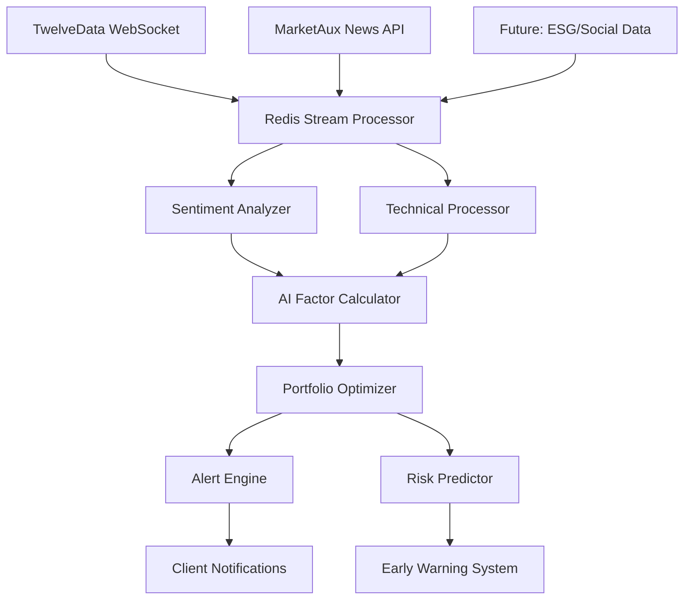

# Waardhaven AutoIndex - System Architecture

## Executive Summary

Waardhaven AutoIndex is a modern portfolio management platform built with a modular, microservices-ready architecture. The system consists of five main components:

1. **FastAPI Backend** - Modular Python API server with async capabilities
2. **Next.js Frontend** - React-based web application with TypeScript
3. **PostgreSQL Database** - Persistent data storage with automatic migrations
4. **Redis Cache** - High-performance caching layer with automatic invalidation
5. **Celery Workers** - Background task processing with queue management

All components are deployed on Render.com with automatic CI/CD from GitHub.

## Architecture Overview

```
┌──────────────────────────────────────────────────────────────────┐
│                         Client Browser                           │
│                    (Next.js React Application)                   │
└──────────────────────────────────────────────────────────────────┘
                                  │
                                  │ HTTPS
                                  ▼
┌──────────────────────────────────────────────────────────────────┐
│                      Render CDN & Edge Network                   │
└──────────────────────────────────────────────────────────────────┘
                                  │
                    ┌─────────────┴─────────────┐
                    │                           │
                    ▼                           ▼
┌─────────────────────────────┐   ┌─────────────────────────────┐
│   Frontend Service          │   │   Backend API Service       │
│   (Next.js on Render)       │   │   (FastAPI on Render)       │
│                             │   │                             │
│   waardhaven-web.           │   │   waardhaven-api.           │
│   onrender.com              │   │   onrender.com              │
└─────────────────────────────┘   └─────────────────────────────┘
                    │                           │
                    │              ┌────────────┴────────────┐
                    │              │                         │
                    │              ▼                         ▼
                    │   ┌─────────────────────┐  ┌─────────────────────┐
                    │   │   Redis Cache       │  │   Celery Workers    │
                    │   │   (In-Memory)       │  │   (Background)      │
                    │   │                     │  │                     │
                    │   │   - API Response    │  │   - Data Refresh    │
                    │   │   - Session Data    │  │   - Report Gen      │
                    │   │   - Hot Data        │  │   - Index Calc      │
                    │   └─────────────────────┘  └─────────────────────┘
                    │              │                         │
                    │              └────────────┬────────────┘
                    │                           │ SQL/TCP
                    │                           ▼
                    │              ┌─────────────────────────────┐
                    │              │   PostgreSQL Database       │
                    │              │   (Render Managed)          │
                    │              │                             │
                    │              │   - Users & Auth            │
                    │              │   - Assets & Prices         │
                    │              │   - Index Values            │
                    │              │   - Allocations             │
                    │              │   - Strategy Configs        │
                    │              └─────────────────────────────┘
                    │                           │
                    └───────────────────────────┘
                                  │
                                  ▼
                    ┌─────────────────────────────┐
                    │   External APIs             │
                    │                             │
                    │   - TwelveData (Market)    │
                    │   - Exchange Rates API     │
                    └─────────────────────────────┘
```

## Backend Architecture (FastAPI)

### Modular Structure

```
apps/api/app/
├── core/                  # Core functionality
│   ├── config.py         # Environment & settings
│   ├── database.py       # Database connection & pooling
│   ├── redis_client.py   # Redis cache connection
│   └── celery_app.py     # Celery task queue config
│
├── models/               # Domain models (SQLAlchemy)
│   ├── user.py          # User authentication
│   ├── asset.py         # Assets & prices
│   ├── index.py         # Index & allocations
│   └── strategy.py      # Strategy & risk metrics
│
├── schemas/              # API contracts (Pydantic)
│   ├── auth.py          # Auth request/response
│   ├── index.py         # Portfolio schemas
│   ├── benchmark.py     # Benchmark schemas
│   ├── strategy.py      # Strategy schemas
│   └── validation.py    # Common validators
│
├── routers/              # API endpoints
│   ├── auth.py          # /api/v1/auth/*
│   ├── index.py         # /api/v1/index/*
│   ├── benchmark.py     # /api/v1/benchmark/*
│   ├── strategy.py      # /api/v1/strategy/*
│   ├── background.py    # /api/v1/background/*
│   ├── diagnostics.py   # /api/v1/diagnostics/*
│   └── manual_refresh.py# /api/v1/manual/*
│
├── services/             # Business logic
│   ├── refresh.py       # Data refresh pipeline
│   ├── strategy.py      # Portfolio allocation
│   ├── performance.py   # Risk metrics & calculations
│   ├── twelvedata.py    # Market data client
│   └── currency.py      # FX conversion
│
├── tasks/                # Background tasks
│   ├── background_tasks.py # Task definitions
│   ├── market_refresh.py   # Async market updates
│   └── report_generation.py# Report processing
│
├── utils/                # Utilities
│   ├── security.py      # JWT & password
│   ├── token_dep.py     # Auth dependencies
│   ├── cache_utils.py   # Redis cache helpers
│   ├── password_validator.py # Password rules
│   ├── create_indexes.py    # DB index creation
│   └── run_migrations.py    # Auto-migrations
│
└── main.py              # Application entry
```

### Key Design Patterns

1. **Domain-Driven Design**: Models organized by business domain
2. **Dependency Injection**: FastAPI's DI for database sessions and auth
3. **Repository Pattern**: Services abstract database operations
4. **DTO Pattern**: Schemas separate API contracts from domain models
5. **Middleware Pipeline**: Security, CORS, rate limiting, headers
6. **Cache-Aside Pattern**: Redis caching with automatic invalidation
7. **Task Queue Pattern**: Celery for async background processing
8. **Unit of Work**: Database transactions with automatic rollback

###  Enterprise Architecture Assessment (2025-08-19)

**Architecture Pattern**: **Hexagonal + Domain-Driven Design**
- ** Ports & Adapters**: Clear separation via `providers/` (external) and `services/` (internal)
- ** Domain Layer**: Pure business logic in `services/` modules
- ** Infrastructure Layer**: External systems in `providers/` with interface contracts
- ** Application Layer**: API routing in `routers/` with proper dependency injection

**SOLID Principles Adherence**:
- **Single Responsibility**: Each service module has one domain concern
- **Open/Closed**: Interface-based providers allow extension without modification
- **Liskov Substitution**: Provider interfaces enable swappable implementations
- **Interface Segregation**: Granular interfaces per domain (market_data, news)
- **Dependency Inversion**: Services depend on abstractions, not concretions

**Distributed Systems Readiness**:
- ** Twelve-Factor**: Config externalized, stateless services, process isolation
- ** Microservices Ready**: Clear bounded contexts (portfolio, market_data, news)
- ** Event-Driven**: Celery tasks with proper queuing
- ** Idempotency**: Background tasks designed for retry safety

### API Endpoints

#### Authentication (`/api/v1/auth`)
- `POST /register` - User registration
- `POST /login` - User authentication
- `POST /google` - Google OAuth authentication

#### Portfolio Management (`/api/v1/index`)
- `GET /current` - Current allocations
- `GET /history` - Historical performance
- `POST /simulate` - Investment simulation
- `GET /currencies` - Supported currencies
- `GET /assets/{symbol}/history` - Asset history

#### Strategy (`/api/v1/strategy`)
- `GET /config` - Current strategy
- `PUT /config` - Update strategy
- `POST /config/ai-adjust` - AI adjustments
- `GET /risk-metrics` - Risk analytics
- `POST /rebalance` - Trigger rebalance

#### Background Tasks (`/api/v1/background`)
- `POST /refresh-market-data` - Async market data update
- `POST /compute-index` - Async index calculation
- `POST /generate-report` - Async report generation
- `POST /cleanup-old-data` - Async data cleanup
- `GET /task/{task_id}` - Check task status

#### Market Data (`/api/v1/manual`)
- `POST /trigger-refresh` - Standard refresh
- `POST /smart-refresh` - Optimized refresh
- `POST /minimal-refresh` - Test refresh

#### Diagnostics (`/api/v1/diagnostics`)
- `GET /database-status` - DB health
- `GET /refresh-status` - Data freshness
- `GET /cache-status` - Redis cache metrics
- `POST /test-refresh` - Test pipeline
- `POST /recalculate-index` - Recalculate

## Frontend Architecture (Next.js)

### Component Structure

```
apps/web/app/
├── components/           # Reusable components
│   ├── charts/          # Chart components
│   ├── portfolio/       # Portfolio widgets
│   ├── strategy/        # Strategy controls
│   └── ui/              # UI primitives
│
├── services/            # API clients
│   ├── api/
│   │   ├── base.ts     # Base API service
│   │   ├── portfolio.ts# Portfolio endpoints
│   │   ├── market.ts   # Market data endpoints
│   │   └── background.ts# Background task endpoints
│   └── aiInsights.ts   # AI service
│
├── hooks/               # Custom React hooks
│   ├── usePortfolioData.ts
│   ├── useSimulation.ts
│   └── useChartData.ts
│
├── types/               # TypeScript types
│   ├── api.ts          # API types
│   ├── portfolio.ts    # Portfolio types
│   └── chart.ts        # Chart types
│
├── lib/                 # Libraries & utilities
│   └── utils.ts        # Helper functions
│
├── contexts/            # React contexts
│   └── AuthContext.tsx # Auth state management
│
├── constants/           # Configuration
│   ├── config.ts       # App config
│   └── theme.ts        # Theme constants
│
└── (routes)/           # Next.js pages
    ├── page.tsx        # Home
    ├── dashboard/      # Dashboard
    ├── login/          # Auth pages
    ├── reports/        # Report views
    ├── tasks/          # Task management
    └── admin/          # Admin panel
```

### Frontend-Backend Integration

#### API Client Configuration

```typescript
// Base configuration
const API_URL = process.env.NEXT_PUBLIC_API_URL || 'http://localhost:8000';

// Authentication handling
- JWT tokens stored in localStorage
- Automatic token injection in headers
- Global 401 error handling

// Service layer pattern
- Base ApiService class for common functionality
- Domain-specific services (portfolio, market, strategy)
- Type-safe API calls with TypeScript
```

#### Data Flow

1. **User Action** → React Component
2. **Component** → Custom Hook
3. **Hook** → API Service
4. **API Service** → HTTP Request
5. **Backend** → Process & Response
6. **Response** → Update State
7. **State** → Re-render Component

## Database Schema

### Core Tables

```sql
-- User Management
users (id, email, password_hash, created_at)

-- Market Data
assets (id, symbol, name, sector, asset_type, exchange)
prices (id, asset_id, date, open, high, low, close, volume)
  INDEX: (asset_id, date) -- Composite index for performance

-- Portfolio
index_values (id, date, value, created_at, updated_at)
  INDEX: (date) -- For time-series queries
allocations (id, date, asset_id, weight, created_at)
  INDEX: (date, asset_id) -- Composite index

-- Strategy
strategy_configs (id, weights, parameters, ai_metadata, created_at)
risk_metrics (id, date, metrics, performance, drawdown, correlation)
```

### Relationships

- **User** → Authentication (1:1)
- **Asset** → Prices (1:N)
- **Asset** → Allocations (1:N)
- **IndexValue** ← Strategy (N:1)
- **StrategyConfig** → RiskMetrics (1:N)

## Deployment Architecture

### Infrastructure (Render.com)

```yaml
Services:
  Frontend:
    - Type: Static Site
    - Build: npm run build
    - URL: waardhaven-web.onrender.com
    
  Backend:
    - Type: Web Service
    - Runtime: Python 3.11
    - Build: pip install -r requirements.txt
    - Start: uvicorn app.main:app
    - URL: waardhaven-api.onrender.com
    
  Database:
    - Type: PostgreSQL
    - Version: 15
    - Plan: Starter
    - Backup: Daily
```

### Environment Variables

#### Backend (apps/api/.env)
- `DATABASE_URL` - PostgreSQL connection string
- `SECRET_KEY` - JWT signing key
- `ADMIN_TOKEN` - Admin access token
- `TWELVEDATA_API_KEY` - Market data API key
- `FRONTEND_URL` - CORS allowed origin
- `SKIP_STARTUP_REFRESH` - Skip initial data refresh
- `REDIS_URL` - Redis connection (optional)
- `CELERY_BROKER_URL` - Celery broker URL
- `CELERY_RESULT_BACKEND` - Celery results storage
- `RENDER` - Deployment flag

#### Frontend (apps/web/.env)
- `NEXT_PUBLIC_API_URL` - Backend API URL

### CI/CD Pipeline

1. **GitHub Push** → Main branch
2. **Render Webhook** → Triggered
3. **Build Process** → Dependencies & compilation
4. **Health Check** → Service validation
5. **Deploy** → Blue-green deployment
6. **Rollback** → On failure

## Security Architecture

### Authentication & Authorization

- **JWT Tokens**: Stateless authentication
- **Password Hashing**: bcrypt with salt
- **Token Expiration**: 24-hour validity
- **Dependency Injection**: Route protection

### API Security

- **CORS**: Restricted origins
- **Rate Limiting**: 100 req/min per IP
- **Security Headers**: XSS, frame, content-type
- **HTTPS**: TLS encryption
- **Input Validation**: Pydantic schemas

### Data Protection

- **SQL Injection**: ORM parameterization
- **Environment Variables**: Secrets management
- **Database Encryption**: At-rest encryption
- **Backup**: Daily automated backups

## Performance Optimizations

### Backend

1. **Database**
   - Connection pooling (20 connections max)
   - Composite indexes on (asset_id, date)
   - Batch operations for bulk inserts
   - UPSERT pattern for safe updates
   - Automatic rollback on errors
   - Backup before modifications

2. **Redis Caching**
   - Full caching layer implementation
   - Automatic cache invalidation
   - Graceful fallback when unavailable
   - Cache keys: portfolio data, market data, user sessions
   - TTL: 5-60 minutes based on data type
   - Cache status monitoring endpoint

3. **Background Processing**
   - Celery task queue for async operations
   - Separate queues for different priorities
   - Task monitoring with Flower dashboard
   - Automatic retry with exponential backoff
   - Dead letter queue for failed tasks

4. **API Optimization**
   - Async request handling with FastAPI
   - Pagination for large datasets
   - Selective field returns
   - Request/response compression

### Frontend

1. **Next.js Optimizations**
   - Server-side rendering
   - Static generation where possible
   - Image optimization
   - Code splitting

2. **Client Optimizations**
   - React Query for caching
   - Debounced API calls
   - Lazy loading components
   - Virtual scrolling for lists

## Monitoring & Observability

### Health Checks

- `/health` - Basic liveness
- `/api/v1/diagnostics/database-status` - DB health
- `/api/v1/diagnostics/refresh-status` - Data freshness

### Logging

- Structured JSON logging
- Request/response logging
- Error tracking with stack traces
- Performance metrics

### Metrics

- Response times
- Error rates
- Database query performance
- External API latency

## Scalability Considerations

### Horizontal Scaling

- Stateless backend services
- Database read replicas
- Load balancer ready
- Session-less authentication

### Vertical Scaling

- Configurable worker processes
- Memory optimization
- Connection pool sizing
- Query optimization

###  Next-Generation Enhancement: AI-Powered Data Fusion Platform

### Executive Summary
Transform Waardhaven AutoIndex into a next-generation financial intelligence platform leveraging advanced data fusion from multiple sources, incorporating vanguard techniques like multi-factor analysis, sentiment-driven portfolio optimization, and AI-powered alternative data processing.

### 1. Multi-Source Data Fusion Architecture

#### Enhanced Data Pipeline


#### Core Components
- **TwelveData Integration**: Real-time WebSocket streaming + historical data
- **MarketAux Intelligence**: News sentiment analysis + entity tracking
- **AI Factor Models**: Smart beta with sentiment enhancement
- **Event-Driven Pipeline**: Redis Streams for real-time processing
- **Intelligent Caching**: Predictive cache warming based on market events

### 2. AI-Enhanced Portfolio Intelligence

#### Smart Beta Factors with Sentiment
```yaml
Factor Models:
  Momentum Factor:
    Traditional: Price momentum (3, 6, 12 months)
    AI Enhanced: News sentiment momentum correlation
    Weight: Technical trend + sentiment trend alignment

  Quality Factor:
    Traditional: ROE, debt ratios, earnings stability
    AI Enhanced: Earnings call sentiment, management tone
    Weight: Fundamental quality + sentiment quality

  Value Factor:
    Traditional: P/E, P/B, EV/EBITDA ratios
    AI Enhanced: Contrarian news sentiment signals
    Weight: Valuation metrics + sentiment discount

  Volatility Factor:
    Traditional: Historical price volatility
    AI Enhanced: News impact volatility prediction
    Weight: Price vol + expected sentiment vol
```

#### Real-Time Analytics
- **Sentiment-Enhanced Allocation**: News sentiment influences factor weights
- **Risk Prediction**: Early warning based on news pattern recognition
- **Event Detection**: Automatic identification of market-moving events
- **Correlation Analysis**: Cross-asset sentiment correlation tracking

### 3. Monetization & Subscription Tiers

#### Revenue Model
- **Individual Tier**: $9.99/month (Smart beta portfolios + basic sentiment)
- **Professional Tier**: $49.99/month (Real-time analytics + custom factors)
- **Institutional Tier**: $199.99/month (White-label + full API access)
- **Projected ARR**: $360k+ within 18 months

### 4. Technical Implementation Roadmap

#### Phase 1: Enhanced Data Pipeline (4 weeks)
- [ ] TwelveData WebSocket streaming implementation
- [ ] MarketAux sentiment analysis integration
- [ ] Unified data normalization layer
- [ ] Redis Stream processing architecture
- [ ] Sentiment-enhanced factor models

#### Phase 2: AI-Powered Analytics (6 weeks)
- [ ] Multi-factor calculation engine
- [ ] Real-time portfolio optimization
- [ ] News-driven risk modeling
- [ ] Alert and notification system
- [ ] Performance attribution system

#### Phase 3: Monetization Features (8 weeks)
- [ ] Multi-tier subscription system
- [ ] Professional analytics dashboard
- [ ] API marketplace development
- [ ] White-label platform capabilities
- [ ] Advanced backtesting engine

### 5. Competitive Advantages
- **First-to-Market**: Integrated news sentiment + portfolio optimization
- **Cost Democratization**: 99% cost reduction vs Bloomberg Terminal
- **Real-Time Intelligence**: Live sentiment-enhanced decisions
- **Modern Architecture**: Cloud-native vs legacy competitors
- **Customization**: Build proprietary factor models

### 6. Future Enhancements (Legacy Roadmap)

1. **Microservices Split** (Post-AI Platform)
   - Auth service
   - Market data service
   - Portfolio service
   - Strategy service
   - Sentiment analysis service

2. **Event-Driven Architecture**
   - Kafka/RabbitMQ expansion
   - Event sourcing
   - CQRS pattern
   - Real-time streaming

3. **Advanced Data Sources**
   - ESG data integration
   - Social sentiment (Reddit, Twitter)
   - Satellite imagery
   - Economic indicators
   - Alternative data feeds

4. **Enterprise Features**
   - Multi-portfolio management
   - Client reporting automation
   - Compliance tools
   - Risk monitoring dashboards

5. **API & Integration**
   - GraphQL alternative
   - Third-party integrations
   - Mobile SDKs
   - Webhook system

## Development Workflow

### Local Development

```bash
# Backend
cd apps/api
pip install -r requirements.txt
uvicorn app.main:app --reload

# Frontend
cd apps/web
npm install
npm run dev

# Database
docker-compose up postgres
```

### Testing Strategy

1. **Unit Tests**: 
   - Service logic coverage (70%+ target)
   - Pytest framework
   - SQLite for test database
   - Mock external services

2. **Integration Tests**: 
   - API endpoint testing
   - Database transaction tests
   - Redis cache tests
   - Background task tests

3. **E2E Tests**: User workflows
4. **Performance Tests**: Load testing

### Test Commands
```bash
# Current testing infrastructure (being rebuilt)
# See: docs/03-implementation/backend/testing/TESTING_STRATEGY.md
# Status: Infrastructure ready, 95%+ coverage target

# Planned test commands (implementation pending)
npm run test:api              # All backend tests
npm run test:api:coverage     # With coverage reporting
npm run test:api:unit         # Fast unit tests only
npm run test:api:integration  # Slow integration tests
npm run test:frontend         # Frontend component tests
npm run test:e2e             # End-to-end workflows
```

### Code Quality

- **Linting**: 
  - Python: Ruff, Black, Flake8
  - JavaScript: ESLint
- **Type Checking**: 
  - Python: mypy
  - TypeScript: tsc --noEmit
- **Code Review**: PR process
- **Documentation**: Inline + markdown
- **Security**: 
  - bcrypt password hashing
  - JWT authentication
  - Input validation with Pydantic

## Conclusion

The Waardhaven AutoIndex architecture is designed for:

- **Modularity**: Clear separation of concerns
- **Scalability**: Ready for growth
- **Maintainability**: Clean code structure
- **Security**: Defense in depth
- **Performance**: Optimized for speed
- **Reliability**: Error handling & recovery

The modular structure allows for easy extension, testing, and deployment while maintaining clean boundaries between different parts of the system.