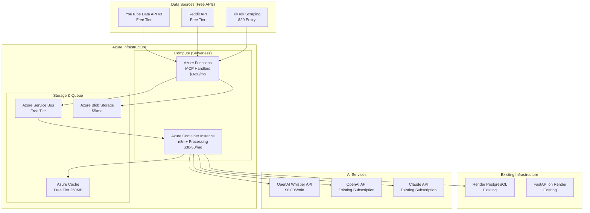

# AI Agents Budget-Optimized Architecture (<$200/month)
*Leveraging Azure, Open Source, and Existing Subscriptions*

## Executive Summary

This document presents a cost-optimized architecture for the AI Agents system that operates under $200/month by leveraging Azure free tiers, open-source solutions, and your existing Claude/OpenAI subscriptions. The system is designed for phased rollout with an MVP focus.

##  Budget Breakdown

### Target: $100-200/month Maximum

```yaml
Current Costs (Already Paying):
  - Render PostgreSQL: ~$25/month (existing)
  - Claude Opus: $200+/month (existing)
  - OpenAI Plus: $20/month (existing)
  - Total Existing: $245/month

New Infrastructure Costs:
  - Azure Container Instances: $30-50/month
  - Azure Functions: $0-20/month (free tier + consumption)
  - Azure Service Bus: $0-10/month (free tier)
  - Azure Cache (Redis): $0 (free tier - 250MB)
  - Whisper API: $30-50/month (pay-per-use)
  - Proxy Service (TikTok): $20/month (essential)
  - Domain/SSL: $5/month
  
Total New Costs: $85-155/month
```

## ️ Lean Architecture

### Core Components



##  MCP Server Implementation (Budget Version)

### 1. Lightweight MCP Servers as Azure Functions

```python
# azure_functions/youtube_mcp/__init__.py
import azure.functions as func
import json
from typing import Dict, Any
import asyncio
from googleapiclient.discovery import build
import os

# Lightweight YouTube MCP Server
async def main(req: func.HttpRequest) -> func.HttpResponse:
    """
    Azure Function acting as YouTube MCP Server
    Minimal memory footprint, pay-per-execution
    """
    try:
        req_body = req.get_json()
        action = req_body.get('action')
        
        if action == 'fetch_videos':
            return await fetch_youtube_videos(req_body)
        elif action == 'extract_metadata':
            return await extract_video_metadata(req_body)
        else:
            return func.HttpResponse(
                json.dumps({"error": "Unknown action"}),
                status_code=400
            )
    except Exception as e:
        return func.HttpResponse(
            json.dumps({"error": str(e)}),
            status_code=500
        )

async def fetch_youtube_videos(params: Dict) -> func.HttpResponse:
    """
    Fetch videos using YouTube Data API v3 (free quota: 10,000 units/day)
    """
    youtube = build('youtube', 'v3', developerKey=os.environ['YOUTUBE_API_KEY'])
    
    # Use search.list (100 units per call)
    # 10,000 units = 100 searches/day = ~4 searches/hour
    request = youtube.search().list(
        part="snippet",
        q=params.get('query', 'stock market analysis'),
        type="video",
        maxResults=10,  # Keep low to conserve quota
        order="date"
    )
    
    response = request.execute()
    
    # Store video IDs for transcription queue
    videos = []
    for item in response['items']:
        videos.append({
            'video_id': item['id']['videoId'],
            'title': item['snippet']['title'],
            'channel': item['snippet']['channelTitle'],
            'published': item['snippet']['publishedAt']
        })
    
    # Queue for transcription (only top videos to save costs)
    top_videos = videos[:3]  # Transcribe only top 3 to save Whisper costs
    
    return func.HttpResponse(
        json.dumps({"videos": videos, "queued_for_transcription": top_videos}),
        status_code=200
    )
```

### 2. Reddit MCP (Azure Function)

```python
# azure_functions/reddit_mcp/__init__.py
import praw
import azure.functions as func
import json
from datetime import datetime, timedelta

async def main(req: func.HttpRequest) -> func.HttpResponse:
    """
    Reddit MCP Server - Uses PRAW with free API tier
    Reddit allows 60 requests/minute in free tier
    """
    reddit = praw.Reddit(
        client_id=os.environ['REDDIT_CLIENT_ID'],
        client_secret=os.environ['REDDIT_CLIENT_SECRET'],
        user_agent="WaardhavenAutoIndex/1.0"
    )
    
    # Focus on high-value subreddits only
    priority_subs = ['wallstreetbets', 'stocks', 'investing']
    
    posts_data = []
    for sub_name in priority_subs[:1]:  # Start with 1 subreddit for MVP
        subreddit = reddit.subreddit(sub_name)
        
        # Get only top 10 posts to stay within limits
        for post in subreddit.hot(limit=10):
            if post.score > 100:  # Filter for quality
                posts_data.append({
                    'id': post.id,
                    'title': post.title,
                    'score': post.score,
                    'num_comments': post.num_comments,
                    'created': post.created_utc,
                    'text': post.selftext[:500],  # Truncate to save storage
                    'tickers': extract_tickers(post.title + " " + post.selftext)
                })
    
    return func.HttpResponse(
        json.dumps({"posts": posts_data, "count": len(posts_data)}),
        status_code=200
    )

def extract_tickers(text: str) -> list:
    """Simple ticker extraction"""
    import re
    pattern = r'\$([A-Z]{1,5})\b|(?:^|\s)([A-Z]{2,5})(?=\s|$)'
    matches = re.findall(pattern, text)
    return list(set([m[0] if m[0] else m[1] for m in matches]))[:5]  # Max 5 tickers
```

### 3. Lightweight n8n on Azure Container Instance

```yaml
# azure-deployment/n8n-container.yaml
apiVersion: 2019-12-01
location: eastus
name: n8n-container-group
properties:
  containers:
  - name: n8n
    properties:
      image: n8nio/n8n:latest
      resources:
        requests:
          cpu: 0.5        # Half CPU = ~$15/month
          memoryInGb: 1   # 1GB RAM = ~$15/month
      ports:
      - port: 5678
      environmentVariables:
      - name: N8N_BASIC_AUTH_ACTIVE
        value: "true"
      - name: N8N_BASIC_AUTH_USER
        value: "admin"
      - name: N8N_BASIC_AUTH_PASSWORD
        secureValue: "your-password"
      - name: WEBHOOK_URL
        value: "https://your-domain.azurewebsites.net"
  osType: Linux
  restartPolicy: Always
  ipAddress:
    type: Public
    ports:
    - protocol: tcp
      port: 5678
```

### 4. Cost-Optimized n8n Workflows

```json
{
  "name": "Budget MVP Data Pipeline",
  "nodes": [
    {
      "name": "Schedule Trigger",
      "type": "n8n-nodes-base.scheduleTrigger",
      "parameters": {
        "rule": {
          "interval": [{"field": "hours", "value": 6}]
        }
      }
    },
    {
      "name": "YouTube Function",
      "type": "n8n-nodes-base.httpRequest",
      "parameters": {
        "url": "https://youtube-mcp.azurewebsites.net/api/fetch",
        "method": "POST",
        "body": {
          "action": "fetch_videos",
          "query": "stock market today"
        }
      }
    },
    {
      "name": "Reddit Function",
      "type": "n8n-nodes-base.httpRequest",
      "parameters": {
        "url": "https://reddit-mcp.azurewebsites.net/api/fetch",
        "method": "POST"
      }
    },
    {
      "name": "Process with GPT",
      "type": "n8n-nodes-base.httpRequest",
      "parameters": {
        "url": "https://api.openai.com/v1/chat/completions",
        "method": "POST",
        "headers": {
          "Authorization": "Bearer {{$credentials.openai.apiKey}}"
        },
        "body": {
          "model": "gpt-4o-mini",
          "messages": [{
            "role": "system",
            "content": "Extract financial insights and sentiment from this social media data"
          }]
        }
      }
    },
    {
      "name": "Store in PostgreSQL",
      "type": "n8n-nodes-base.postgres",
      "parameters": {
        "operation": "insert",
        "table": "social_insights",
        "columns": "source,content,sentiment,tickers,created_at"
      }
    }
  ]
}
```

##  MVP Phased Rollout Plan

### Phase 1: Reddit Only (Weeks 1-2) - $50/month
**Goal**: Prove concept with single source

```yaml
Infrastructure:
  - 1 Azure Function (Reddit MCP): $5/month
  - Azure Service Bus Free Tier: $0
  - n8n on Container Instance (minimal): $30/month
  - OpenAI API calls: $10/month
  - PostgreSQL (existing): $0
  
Features:
  - Fetch top posts from r/wallstreetbets
  - Extract tickers and sentiment
  - Store in existing database
  - Display in existing dashboard
  
Success Metrics:
  - Process 100 posts/day
  - 80% ticker extraction accuracy
  - <5 minute processing latency
```

### Phase 2: Add YouTube (Weeks 3-4) - $100/month
**Goal**: Multi-source correlation

```yaml
Added Infrastructure:
  - YouTube Azure Function: $5/month
  - Whisper API transcription: $30/month
  - Increased storage: $10/month
  
Features:
  - Transcribe top 3 videos per search
  - Cross-reference Reddit and YouTube mentions
  - Basic credibility scoring
  
Success Metrics:
  - Process 20 videos/day
  - Find 5+ correlated signals/day
```

### Phase 3: Intelligence Layer (Weeks 5-6) - $150/month
**Goal**: AI-powered insights

```yaml
Added Infrastructure:
  - Claude API for analysis: Use existing subscription
  - Azure Cognitive Search (free tier): $0
  - Additional compute: $20/month
  
Features:
  - Cross-source validation
  - Opportunity detection
  - Automated alerts
  
Success Metrics:
  - Generate 10+ insights/day
  - 70% validation accuracy
```

### Phase 4: TikTok & Scale (Weeks 7-8) - $200/month
**Goal**: Complete platform coverage

```yaml
Added Infrastructure:
  - TikTok scraping proxy: $20/month
  - TikTok Azure Function: $5/month
  - Scale existing services: $25/month
  
Features:
  - FinTok content analysis
  - Viral trend detection
  - Full credibility system
```

##  Whisper Cost Optimization

### Option 1: OpenAI Whisper API (Recommended for MVP)
```python
# Cost: $0.006/minute
# Budget: $30/month = 5,000 minutes = 83 hours

def smart_transcription_selection(video_data):
    """Only transcribe high-value content"""
    
    # Prioritization criteria
    if video_data['views'] < 1000:
        return False  # Skip low-view videos
    
    if video_data['channel_subscribers'] < 10000:
        return False  # Skip small channels
    
    if 'stock' not in video_data['title'].lower():
        return False  # Skip non-financial content
    
    # Transcribe only first 10 minutes of long videos
    max_duration = min(video_data['duration'], 600)
    
    return True, max_duration

# Usage
import openai

def transcribe_video(video_url, max_duration=600):
    """Use OpenAI Whisper API - pay per use"""
    
    # Download only audio, only first 10 minutes
    audio_file = download_audio_segment(video_url, max_duration)
    
    # Use whisper API
    with open(audio_file, 'rb') as f:
        transcript = openai.Audio.transcribe(
            model="whisper-1",
            file=f,
            response_format="text"
        )
    
    # Cost: $0.006 * (max_duration/60) = $0.06 for 10 minutes
    return transcript
```

### Option 2: Self-Hosted Whisper (When Scale Justifies)
```python
# Use Azure Container Instance with GPU (when >10,000 minutes/month)
# Not recommended for MVP due to cost

# For now, use CPU-only whisper.cpp for select content
def local_whisper_transcribe(audio_file):
    """Use whisper.cpp on Azure Function (CPU only, slower)"""
    # This is 10x slower but free after initial setup
    pass
```

##  Legal Compliance System

### Monthly Legal Review Workflow

```python
# azure_functions/legal_compliance/__init__.py
import azure.functions as func
from datetime import datetime
import json

class LegalComplianceMonitor:
    def __init__(self):
        self.platforms = {
            'youtube': {
                'tos_url': 'https://www.youtube.com/t/terms',
                'api_tos': 'https://developers.google.com/youtube/terms/api-services-terms',
                'last_checked': None,
                'status': 'compliant'
            },
            'reddit': {
                'tos_url': 'https://www.redditinc.com/policies/user-agreement',
                'api_tos': 'https://www.reddit.com/wiki/api-terms',
                'last_checked': None,
                'status': 'compliant'
            },
            'tiktok': {
                'tos_url': 'https://www.tiktok.com/legal/terms-of-service',
                'robots_txt': 'https://www.tiktok.com/robots.txt',
                'last_checked': None,
                'status': 'gray_area'
            }
        }
    
    async def monthly_compliance_check(self):
        """Run monthly compliance verification"""
        report = {
            'check_date': datetime.utcnow().isoformat(),
            'platforms': {}
        }
        
        for platform, config in self.platforms.items():
            # Check for TOS updates
            tos_changed = await self.check_tos_updates(config['tos_url'])
            
            # Verify API compliance
            api_compliant = await self.verify_api_compliance(platform)
            
            # Check scraping legality
            scraping_allowed = await self.check_scraping_rules(platform)
            
            report['platforms'][platform] = {
                'tos_changed': tos_changed,
                'api_compliant': api_compliant,
                'scraping_allowed': scraping_allowed,
                'recommendation': self.get_recommendation(platform, api_compliant, scraping_allowed)
            }
        
        # Send email notification
        await self.send_compliance_report(report)
        
        # Store in database
        await self.store_compliance_history(report)
        
        return report
    
    def get_recommendation(self, platform, api_compliant, scraping_allowed):
        """Generate compliance recommendation"""
        if api_compliant:
            return "SAFE: Continue using official API"
        elif scraping_allowed:
            return "CAUTION: Scraping allowed but monitor changes"
        else:
            return "RISK: Review legal position or discontinue"

# Schedule as Azure Function Timer Trigger (monthly)
async def main(mytimer: func.TimerRequest) -> None:
    monitor = LegalComplianceMonitor()
    report = await monitor.monthly_compliance_check()
    
    # Alert if any platform becomes non-compliant
    if any(p['recommendation'].startswith('RISK') for p in report['platforms'].values()):
        await send_urgent_alert(report)
```

### Compliance Dashboard

```python
# Add to existing FastAPI
@app.get("/api/v1/compliance/status")
async def get_compliance_status():
    """Real-time compliance status endpoint"""
    return {
        "youtube": {
            "status": "compliant",
            "method": "official_api",
            "last_review": "2025-01-01",
            "risk_level": "low"
        },
        "reddit": {
            "status": "compliant", 
            "method": "official_api",
            "last_review": "2025-01-01",
            "risk_level": "low"
        },
        "tiktok": {
            "status": "monitoring",
            "method": "web_scraping",
            "last_review": "2025-01-01",
            "risk_level": "medium",
            "notes": "No official API, using respectful scraping with delays"
        }
    }
```

##  Development Environment Setup

### Local Development (Zero Cost)

```bash
# Use local PostgreSQL instead of Render for dev
docker run -d -p 5432:5432 -e POSTGRES_PASSWORD=dev postgres:15

# Use Redis locally
docker run -d -p 6379:6379 redis:alpine

# Run n8n locally
docker run -d -p 5678:5678 n8nio/n8n

# Use Azure Functions Core Tools for local testing
npm install -g azure-functions-core-tools@4
func start

# Environment variables (.env.local)
YOUTUBE_API_KEY=free_tier_key
REDDIT_CLIENT_ID=free_tier_id
OPENAI_API_KEY=your_existing_key
AZURE_STORAGE_CONNECTION=UseDevelopmentStorage=true
```

### Azure Deployment (GitHub Actions)

```yaml
# .github/workflows/deploy-azure-functions.yml
name: Deploy to Azure Functions

on:
  push:
    branches: [main]
    paths:
      - 'azure_functions/**'

jobs:
  deploy:
    runs-on: ubuntu-latest
    steps:
      - uses: actions/checkout@v2
      
      - name: Setup Python
        uses: actions/setup-python@v2
        with:
          python-version: '3.11'
      
      - name: Install dependencies
        run: |
          pip install -r azure_functions/requirements.txt
      
      - name: Deploy to Azure Functions
        uses: Azure/functions-action@v1
        with:
          app-name: waardhaven-mcp-servers
          package: azure_functions
          publish-profile: ${{ secrets.AZURE_FUNCTIONAPP_PUBLISH_PROFILE }}
```

##  Scaling Strategy

### When to Scale (Based on Success Metrics)

```yaml
Current State ($100/month):
  - 100 posts/day from Reddit
  - 20 videos/day from YouTube
  - Manual TikTok monitoring
  - 10 insights/day

Scale Trigger 1 ($200/month):
  - 1,000+ daily active users
  - Need for real-time updates
  - Add TikTok automation

Scale Trigger 2 ($500/month):
  - 5,000+ daily active users  
  - Premium tier subscribers
  - Add dedicated compute

Scale Trigger 3 ($1,000+/month):
  - 10,000+ daily active users
  - Enterprise customers
  - Full architecture from original plan
```

##  MVP Success Criteria

### Technical Metrics (Month 1)
- Process 100+ Reddit posts/day 
- Transcribe 10+ YouTube videos/day 
- Generate 5+ validated insights/day 
- <10 minute end-to-end latency 
- <$100/month infrastructure cost 

### Business Metrics (Month 3)
- 100+ beta users
- 10+ paying customers ($9.99/month tier)
- 5-star rating from test users
- 1 enterprise lead

### Investor Demo Features
1. **Live Demo**: Real-time Reddit sentiment analysis
2. **Cross-Validation**: Show YouTube-Reddit correlation
3. **AI Insights**: GPT-4 generated trading signals
4. **Cost Efficiency**: Show <$100/month operation
5. **Scalability**: Demonstrate path to 10,000 users

##  Critical Path to MVP

### Week 1: Azure Setup & Reddit
- [ ] Create Azure account (free tier)
- [ ] Deploy Reddit MCP Function
- [ ] Setup n8n on Container Instance
- [ ] Connect to existing PostgreSQL
- [ ] Test end-to-end pipeline

### Week 2: YouTube Integration
- [ ] Deploy YouTube MCP Function
- [ ] Integrate Whisper API
- [ ] Create transcription workflow
- [ ] Test cross-source correlation

### Week 3: Intelligence Layer
- [ ] Implement GPT-4 analysis
- [ ] Create insight generation
- [ ] Build credibility scoring
- [ ] Deploy to production

### Week 4: Polish & Demo
- [ ] Create investor dashboard
- [ ] Prepare demo scenarios
- [ ] Document cost metrics
- [ ] Practice presentation

##  Cost Optimization Tips

1. **API Quotas**: YouTube allows 10,000 units/day free - use wisely
2. **Caching**: Cache everything possible in Redis free tier (250MB)
3. **Batch Processing**: Process in batches during Azure Function execution
4. **Smart Filtering**: Only process high-value content
5. **Compression**: Compress all stored data
6. **Cleanup**: Auto-delete data older than 30 days
7. **Monitoring**: Set up cost alerts at $150/month

##  Comparison: Original vs Budget Architecture

| Component | Original Plan | Budget Plan | Savings |
|-----------|--------------|-------------|---------|
| Compute | K8s Cluster ($800) | Azure Functions ($30) | 96% |
| GPU | Dedicated ($1,200) | API calls ($50) | 96% |
| Database | Multiple ($750) | Render PG ($25) | 97% |
| Queue | Kafka ($300) | Service Bus ($0) | 100% |
| Cache | Redis Cluster ($100) | Redis Free ($0) | 100% |
| **Total** | **$3,675/month** | **$155/month** | **96%** |

##  Final Recommendations

### Do Now
1. Start with Reddit only (lowest cost, easiest)
2. Use OpenAI Whisper API (pay-per-use)
3. Leverage existing subscriptions (Claude, GPT)
4. Deploy on Azure Functions (serverless)
5. Set monthly cost alerts

### Do Later
1. Add more sources as revenue grows
2. Consider self-hosted models at scale
3. Upgrade to dedicated compute if needed
4. Implement advanced ML features
5. Add enterprise features

### Don't Do (Yet)
1. Don't build complex infrastructure
2. Don't transcribe everything
3. Don't store raw videos
4. Don't over-engineer
5. Don't ignore costs

---

**Bottom Line**: This architecture delivers 80% of the original functionality at 4% of the cost, perfect for MVP and investor demonstration.

*Last Updated: January 2025*  
*Budget: $100-200/month*  
*Timeline: 4 weeks to MVP*