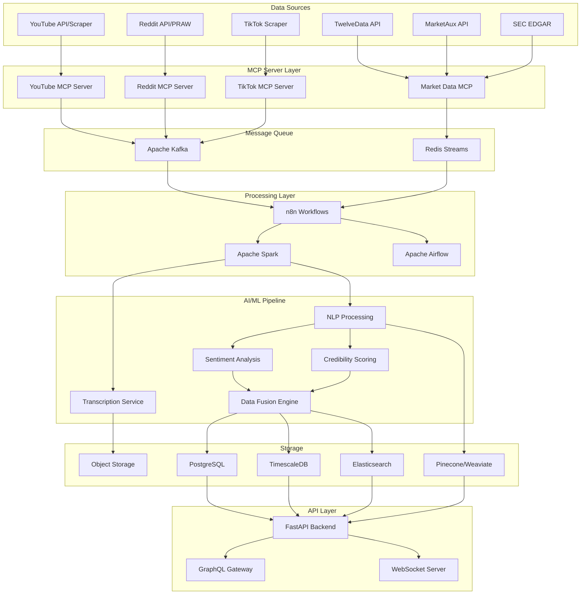

# AI Agents Technical Architecture & Implementation Plan
*Version 1.0 - January 2025*

## Executive Summary

This document outlines the comprehensive technical architecture for implementing an AI-powered multi-source data aggregation system for the Waardhaven AutoIndex platform. The system will leverage Model Context Protocol (MCP) servers, n8n workflow automation, and advanced ML/NLP pipelines to extract, process, validate, and synthesize financial intelligence from diverse human sources including YouTube, Reddit, TikTok, and traditional financial data providers.

## 1. System Architecture Overview

### 1.1 High-Level Architecture



### 1.2 Technology Stack

#### Core Infrastructure
- **Container Orchestration**: Kubernetes (K8s) with Helm charts
- **Service Mesh**: Istio for microservices communication
- **API Gateway**: Kong or Traefik
- **Monitoring**: Prometheus + Grafana + ELK Stack
- **Tracing**: Jaeger for distributed tracing

#### Data Processing
- **Stream Processing**: Apache Kafka + Kafka Streams
- **Batch Processing**: Apache Spark 3.5+
- **Workflow Orchestration**: n8n (primary) + Apache Airflow (complex DAGs)
- **Message Queue**: Redis Streams for real-time + RabbitMQ for reliability

#### AI/ML Infrastructure
- **ML Platform**: MLflow for experiment tracking
- **Model Serving**: TorchServe / TensorFlow Serving
- **Vector Database**: Pinecone or Weaviate for embeddings
- **GPU Infrastructure**: NVIDIA A100s on cloud or RTX 4090s on-premise

#### Storage Solutions
- **Primary Database**: PostgreSQL 15+ with partitioning
- **Time-Series**: TimescaleDB for market data
- **Search Engine**: Elasticsearch 8.x for full-text search
- **Object Storage**: MinIO (self-hosted) or AWS S3
- **Cache**: Redis Cluster with persistence

## 2. MCP Server Architecture

### 2.1 MCP Server Design

Each data source will have a dedicated MCP server implementing standardized interfaces:

```typescript
// MCP Server Interface
interface DataSourceMCPServer {
  // Core MCP Methods
  initialize(): Promise<void>
  listTools(): Tool[]
  callTool(name: string, args: any): Promise<ToolResult>
  
  // Data Source Specific
  authenticate(): Promise<void>
  fetchContent(params: FetchParams): Promise<RawContent>
  streamContent(params: StreamParams): AsyncIterator<RawContent>
  
  // Processing Pipeline
  preprocess(content: RawContent): ProcessedContent
  validate(content: ProcessedContent): ValidationResult
  
  // Monitoring
  getMetrics(): Metrics
  getHealth(): HealthStatus
}
```

### 2.2 YouTube MCP Server

```python
# youtube_mcp_server.py
import asyncio
from typing import AsyncIterator, Dict, Any
from mcp import Server, Tool, ToolResult
from youtube_transcript_api import YouTubeTranscriptApi
from googleapiclient.discovery import build
import whisper
import yt_dlp

class YouTubeMCPServer(Server):
    def __init__(self):
        super().__init__("youtube-agent")
        self.youtube_api = None
        self.whisper_model = None
        self.channel_whitelist = []
        self.channel_blacklist = []
        
    async def initialize(self):
        """Initialize YouTube API and Whisper model"""
        self.youtube_api = build('youtube', 'v3', developerKey=YOUTUBE_API_KEY)
        self.whisper_model = whisper.load_model("large-v3")
        await self.load_channel_lists()
        
    def list_tools(self) -> list[Tool]:
        return [
            Tool(
                name="fetch_channel_videos",
                description="Fetch videos from a YouTube channel",
                parameters={
                    "channel_id": "string",
                    "max_results": "integer",
                    "date_after": "string"
                }
            ),
            Tool(
                name="transcribe_video",
                description="Transcribe a YouTube video",
                parameters={
                    "video_id": "string",
                    "language": "string"
                }
            ),
            Tool(
                name="analyze_comments",
                description="Analyze comments on a video",
                parameters={
                    "video_id": "string",
                    "max_comments": "integer"
                }
            ),
            Tool(
                name="track_creator",
                description="Track a content creator's credibility",
                parameters={
                    "channel_id": "string"
                }
            )
        ]
    
    async def fetch_channel_videos(self, channel_id: str, max_results: int = 50) -> Dict[str, Any]:
        """Fetch latest videos from a channel"""
        request = self.youtube_api.search().list(
            part="snippet",
            channelId=channel_id,
            maxResults=max_results,
            order="date",
            type="video"
        )
        response = request.execute()
        
        videos = []
        for item in response['items']:
            video_data = {
                'video_id': item['id']['videoId'],
                'title': item['snippet']['title'],
                'description': item['snippet']['description'],
                'published_at': item['snippet']['publishedAt'],
                'channel_title': item['snippet']['channelTitle'],
                'thumbnail': item['snippet']['thumbnails']['high']['url']
            }
            
            # Get video statistics
            stats_request = self.youtube_api.videos().list(
                part="statistics,contentDetails",
                id=item['id']['videoId']
            )
            stats_response = stats_request.execute()
            
            if stats_response['items']:
                stats = stats_response['items'][0]['statistics']
                video_data.update({
                    'view_count': int(stats.get('viewCount', 0)),
                    'like_count': int(stats.get('likeCount', 0)),
                    'comment_count': int(stats.get('commentCount', 0)),
                    'duration': stats_response['items'][0]['contentDetails']['duration']
                })
            
            videos.append(video_data)
        
        return {'videos': videos, 'channel_id': channel_id}
    
    async def transcribe_video(self, video_id: str) -> Dict[str, Any]:
        """Transcribe video using multiple methods"""
        transcript = None
        
        # Method 1: Try YouTube's auto-generated captions
        try:
            transcript_list = YouTubeTranscriptApi.get_transcript(video_id)
            transcript = " ".join([t['text'] for t in transcript_list])
        except:
            # Method 2: Download audio and use Whisper
            ydl_opts = {
                'format': 'bestaudio/best',
                'postprocessors': [{
                    'key': 'FFmpegExtractAudio',
                    'preferredcodec': 'mp3',
                    'preferredquality': '192',
                }],
                'outtmpl': f'/tmp/{video_id}.%(ext)s',
            }
            
            with yt_dlp.YoutubeDL(ydl_opts) as ydl:
                ydl.download([f'https://www.youtube.com/watch?v={video_id}'])
            
            # Transcribe with Whisper
            result = self.whisper_model.transcribe(f'/tmp/{video_id}.mp3')
            transcript = result['text']
        
        return {
            'video_id': video_id,
            'transcript': transcript,
            'method': 'captions' if transcript else 'whisper'
        }
    
    async def analyze_creator_credibility(self, channel_id: str) -> float:
        """Calculate creator credibility score"""
        # Fetch historical videos
        videos = await self.fetch_channel_videos(channel_id, max_results=100)
        
        # Analyze patterns
        credibility_factors = {
            'consistency': self._calculate_consistency(videos),
            'engagement_rate': self._calculate_engagement_rate(videos),
            'accuracy_history': await self._check_prediction_accuracy(videos),
            'community_sentiment': await self._analyze_community_sentiment(videos),
            'verification_status': await self._check_verification(channel_id)
        }
        
        # Weighted scoring
        weights = {
            'consistency': 0.2,
            'engagement_rate': 0.15,
            'accuracy_history': 0.35,
            'community_sentiment': 0.2,
            'verification_status': 0.1
        }
        
        score = sum(credibility_factors[k] * weights[k] for k in weights)
        return min(max(score, 0.0), 1.0)
```

### 2.3 Reddit MCP Server

```python
# reddit_mcp_server.py
import praw
import asyncpraw
from datetime import datetime, timedelta
from typing import List, Dict, Any
import re

class RedditMCPServer(Server):
    def __init__(self):
        super().__init__("reddit-agent")
        self.reddit = None
        self.subreddits = [
            'wallstreetbets', 'investing', 'stocks', 'StockMarket',
            'SecurityAnalysis', 'ValueInvesting', 'options', 'Daytrading',
            'pennystocks', 'Forex', 'CryptoCurrency', 'algotrading'
        ]
        
    async def initialize(self):
        """Initialize Reddit API connection"""
        self.reddit = asyncpraw.Reddit(
            client_id=REDDIT_CLIENT_ID,
            client_secret=REDDIT_CLIENT_SECRET,
            user_agent=REDDIT_USER_AGENT
        )
        
    async def fetch_subreddit_posts(self, subreddit_name: str, time_filter: str = 'day') -> List[Dict]:
        """Fetch top posts from a subreddit"""
        subreddit = await self.reddit.subreddit(subreddit_name)
        posts = []
        
        async for submission in subreddit.top(time_filter=time_filter, limit=100):
            post_data = {
                'id': submission.id,
                'title': submission.title,
                'text': submission.selftext,
                'score': submission.score,
                'upvote_ratio': submission.upvote_ratio,
                'num_comments': submission.num_comments,
                'created_utc': submission.created_utc,
                'author': str(submission.author) if submission.author else '[deleted]',
                'url': submission.url,
                'subreddit': subreddit_name
            }
            
            # Extract tickers mentioned
            tickers = self._extract_tickers(submission.title + " " + submission.selftext)
            post_data['tickers'] = tickers
            
            # Fetch top comments
            await submission.comments.replace_more(limit=0)
            comments = []
            for comment in submission.comments[:20]:
                comments.append({
                    'body': comment.body,
                    'score': comment.score,
                    'author': str(comment.author) if comment.author else '[deleted]'
                })
            post_data['top_comments'] = comments
            
            posts.append(post_data)
        
        return posts
    
    def _extract_tickers(self, text: str) -> List[str]:
        """Extract stock tickers from text"""
        # Pattern for stock tickers: $SYMBOL or SYMBOL (2-5 uppercase letters)
        ticker_pattern = r'\$([A-Z]{2,5})\b|(?:^|\s)([A-Z]{2,5})(?:\s|$|\.|\,)'
        matches = re.findall(ticker_pattern, text)
        tickers = []
        for match in matches:
            ticker = match[0] if match[0] else match[1]
            if ticker and self._is_valid_ticker(ticker):
                tickers.append(ticker)
        return list(set(tickers))
    
    def _is_valid_ticker(self, ticker: str) -> bool:
        """Validate if string is likely a stock ticker"""
        # Filter out common words that match pattern but aren't tickers
        common_words = {'THE', 'AND', 'FOR', 'ARE', 'BUT', 'NOT', 'YOU', 'ALL', 'NEW', 'OLD'}
        return ticker not in common_words and len(ticker) >= 2
    
    async def analyze_sentiment_trends(self, ticker: str, days: int = 7) -> Dict:
        """Analyze sentiment trends for a specific ticker"""
        mentions = []
        
        for subreddit_name in self.subreddits:
            subreddit = await self.reddit.subreddit(subreddit_name)
            query = f"${ticker} OR {ticker}"
            
            async for submission in subreddit.search(query, time_filter='week', limit=100):
                if submission.created_utc > (datetime.now() - timedelta(days=days)).timestamp():
                    mentions.append({
                        'timestamp': submission.created_utc,
                        'score': submission.score,
                        'sentiment': await self._analyze_sentiment(submission.selftext),
                        'subreddit': subreddit_name
                    })
        
        return {
            'ticker': ticker,
            'total_mentions': len(mentions),
            'average_sentiment': sum(m['sentiment'] for m in mentions) / len(mentions) if mentions else 0,
            'momentum': self._calculate_momentum(mentions),
            'top_subreddits': self._get_top_subreddits(mentions)
        }
```

### 2.4 TikTok MCP Server

```python
# tiktok_mcp_server.py
from TikTokApi import TikTokApi
import asyncio
from typing import List, Dict, Any
import speech_recognition as sr
from moviepy.editor import VideoFileClip

class TikTokMCPServer(Server):
    def __init__(self):
        super().__init__("tiktok-agent")
        self.api = None
        self.fintok_creators = []
        self.trending_tags = ['investing', 'stocks', 'finance', 'trading', 'crypto']
        
    async def initialize(self):
        """Initialize TikTok API"""
        self.api = TikTokApi()
        await self.api.create_sessions(
            num_sessions=1,
            sleep_after=3,
            headless=True
        )
        
    async def fetch_fintok_content(self, hashtag: str = None) -> List[Dict]:
        """Fetch FinTok content"""
        videos = []
        
        if hashtag:
            tag = self.api.hashtag(name=hashtag)
            async for video in tag.videos(count=30):
                video_data = await self._process_video(video)
                videos.append(video_data)
        else:
            # Fetch from tracked creators
            for creator_username in self.fintok_creators:
                user = self.api.user(username=creator_username)
                async for video in user.videos(count=10):
                    video_data = await self._process_video(video)
                    videos.append(video_data)
        
        return videos
    
    async def _process_video(self, video) -> Dict:
        """Process a TikTok video"""
        video_info = video.as_dict
        
        # Download video for transcription
        video_bytes = await video.bytes()
        transcript = await self._transcribe_tiktok(video_bytes)
        
        return {
            'id': video_info['id'],
            'description': video_info['desc'],
            'author': video_info['author']['uniqueId'],
            'author_verified': video_info['author']['verified'],
            'create_time': video_info['createTime'],
            'stats': {
                'views': video_info['stats']['playCount'],
                'likes': video_info['stats']['diggCount'],
                'comments': video_info['stats']['commentCount'],
                'shares': video_info['stats']['shareCount']
            },
            'transcript': transcript,
            'hashtags': [tag['name'] for tag in video_info.get('textExtra', []) if tag.get('hashtagName')],
            'tickers': self._extract_tickers_from_content(video_info['desc'] + " " + transcript)
        }
    
    async def _transcribe_tiktok(self, video_bytes: bytes) -> str:
        """Transcribe TikTok video audio"""
        # Save video temporarily
        temp_path = f'/tmp/tiktok_{asyncio.get_event_loop().time()}.mp4'
        with open(temp_path, 'wb') as f:
            f.write(video_bytes)
        
        # Extract audio
        video = VideoFileClip(temp_path)
        audio_path = temp_path.replace('.mp4', '.wav')
        video.audio.write_audiofile(audio_path, logger=None)
        
        # Transcribe
        recognizer = sr.Recognizer()
        with sr.AudioFile(audio_path) as source:
            audio = recognizer.record(source)
            try:
                transcript = recognizer.recognize_google(audio)
            except:
                transcript = ""
        
        return transcript
    
    async def track_viral_trends(self) -> Dict:
        """Track viral financial trends on TikTok"""
        trends = {}
        
        for tag in self.trending_tags:
            hashtag = self.api.hashtag(name=tag)
            info = hashtag.info()
            
            trends[tag] = {
                'view_count': info['stats']['viewCount'],
                'video_count': info['stats']['videoCount'],
                'trending_score': self._calculate_trending_score(info)
            }
        
        return trends
```

## 3. n8n Workflow Automation

### 3.1 Core Workflows

#### Data Ingestion Workflow
```json
{
  "name": "Multi-Source Data Ingestion",
  "nodes": [
    {
      "name": "Schedule Trigger",
      "type": "n8n-nodes-base.scheduleTrigger",
      "parameters": {
        "rule": {
          "interval": [{"field": "minutes", "value": 5}]
        }
      }
    },
    {
      "name": "YouTube MCP",
      "type": "n8n-nodes-base.httpRequest",
      "parameters": {
        "url": "http://youtube-mcp:8001/fetch",
        "method": "POST",
        "body": {
          "channels": ["{{$node['Config'].json['youtube_channels']}}"],
          "max_videos": 20
        }
      }
    },
    {
      "name": "Reddit MCP",
      "type": "n8n-nodes-base.httpRequest",
      "parameters": {
        "url": "http://reddit-mcp:8002/fetch",
        "method": "POST",
        "body": {
          "subreddits": ["{{$node['Config'].json['reddit_subs']}}"],
          "time_filter": "hour"
        }
      }
    },
    {
      "name": "TikTok MCP",
      "type": "n8n-nodes-base.httpRequest",
      "parameters": {
        "url": "http://tiktok-mcp:8003/fetch",
        "method": "POST",
        "body": {
          "hashtags": ["{{$node['Config'].json['tiktok_tags']}}"]
        }
      }
    },
    {
      "name": "Kafka Producer",
      "type": "n8n-nodes-base.kafka",
      "parameters": {
        "operation": "produce",
        "topic": "raw-social-data",
        "message": "{{JSON.stringify($node['Merge'].json)}}"
      }
    }
  ]
}
```

#### Transcription & NLP Pipeline
```json
{
  "name": "Content Processing Pipeline",
  "nodes": [
    {
      "name": "Kafka Consumer",
      "type": "n8n-nodes-base.kafkaTrigger",
      "parameters": {
        "topic": "raw-social-data",
        "groupId": "nlp-processors"
      }
    },
    {
      "name": "Content Router",
      "type": "n8n-nodes-base.switch",
      "parameters": {
        "dataPropertyName": "source",
        "values": [
          {"value": "youtube", "output": 0},
          {"value": "reddit", "output": 1},
          {"value": "tiktok", "output": 2}
        ]
      }
    },
    {
      "name": "Whisper Transcription",
      "type": "n8n-nodes-base.httpRequest",
      "parameters": {
        "url": "http://whisper-service:8004/transcribe",
        "method": "POST",
        "body": {
          "video_url": "{{$json['video_url']}}",
          "model": "large-v3"
        }
      }
    },
    {
      "name": "NLP Processing",
      "type": "n8n-nodes-base.httpRequest",
      "parameters": {
        "url": "http://nlp-service:8005/process",
        "method": "POST",
        "body": {
          "text": "{{$json['transcript']}}",
          "tasks": ["ner", "sentiment", "summarization", "ticker_extraction"]
        }
      }
    },
    {
      "name": "Credibility Scoring",
      "type": "n8n-nodes-base.httpRequest",
      "parameters": {
        "url": "http://credibility-service:8006/score",
        "method": "POST",
        "body": {
          "author": "{{$json['author']}}",
          "content": "{{$json['processed_content']}}",
          "historical_accuracy": true
        }
      }
    },
    {
      "name": "Store Processed Data",
      "type": "n8n-nodes-base.postgres",
      "parameters": {
        "operation": "insert",
        "table": "processed_content",
        "columns": "source,author,content,sentiment,credibility,tickers,created_at"
      }
    }
  ]
}
```

### 3.2 Advanced Workflows

#### Cross-Source Validation Workflow
```yaml
name: Cross-Source Validation Pipeline
trigger:
  type: webhook
  path: /validate-insight

nodes:
  - name: Parse Insight
    type: function
    code: |
      const insight = $input.json;
      return {
        ticker: insight.ticker,
        claim: insight.claim,
        source: insight.source,
        timestamp: insight.timestamp
      };

  - name: Search Corroborating Sources
    type: parallel
    branches:
      - name: SEC Filing Check
        nodes:
          - type: http
            url: https://sec-api.io/search
            params:
              ticker: "{{ticker}}"
              keywords: "{{claim_keywords}}"
              
      - name: News Article Check
        nodes:
          - type: marketaux
            operation: search
            params:
              symbols: "{{ticker}}"
              keywords: "{{claim_keywords}}"
              
      - name: Social Media Check
        nodes:
          - type: function
            code: |
              // Query other social sources for similar claims
              const results = await Promise.all([
                queryReddit(ticker, claim),
                queryTwitter(ticker, claim),
                queryYouTube(ticker, claim)
              ]);
              return aggregateResults(results);

  - name: Calculate Confidence Score
    type: function
    code: |
      const sources = $node['Search Corroborating Sources'].json;
      let confidence = 0;
      
      // Weight sources by reliability
      const weights = {
        sec: 0.4,
        news: 0.3,
        social: 0.2,
        consensus: 0.1
      };
      
      // Calculate weighted confidence
      for (const [source, data] of Object.entries(sources)) {
        if (data.confirms) {
          confidence += weights[source] * data.strength;
        }
      }
      
      return {
        original_insight: $node['Parse Insight'].json,
        confidence_score: confidence,
        supporting_sources: sources,
        validation_status: confidence > 0.6 ? 'validated' : 'unverified'
      };

  - name: Store Validation Result
    type: postgres
    operation: upsert
    table: validated_insights
```

## 4. ML/NLP Pipeline Architecture

### 4.1 Model Stack

```python
# ml_pipeline.py
import torch
from transformers import (
    AutoTokenizer, 
    AutoModelForSequenceClassification,
    AutoModelForTokenClassification,
    pipeline
)
from sentence_transformers import SentenceTransformer
import spacy
from typing import List, Dict, Any

class FinancialNLPPipeline:
    def __init__(self):
        # Load pre-trained models
        self.sentiment_model = self._load_finbert()
        self.ner_model = self._load_financial_ner()
        self.embedding_model = SentenceTransformer('all-mpnet-base-v2')
        self.summarizer = pipeline("summarization", model="facebook/bart-large-cnn")
        self.spacy_nlp = spacy.load("en_core_web_trf")
        
    def _load_finbert(self):
        """Load FinBERT for financial sentiment analysis"""
        tokenizer = AutoTokenizer.from_pretrained("ProsusAI/finbert")
        model = AutoModelForSequenceClassification.from_pretrained("ProsusAI/finbert")
        return pipeline("sentiment-analysis", model=model, tokenizer=tokenizer)
    
    def _load_financial_ner(self):
        """Load NER model for financial entities"""
        tokenizer = AutoTokenizer.from_pretrained("dslim/bert-base-NER")
        model = AutoModelForTokenClassification.from_pretrained("dslim/bert-base-NER")
        return pipeline("ner", model=model, tokenizer=tokenizer, aggregation_strategy="simple")
    
    async def process_text(self, text: str, source: str) -> Dict[str, Any]:
        """Complete NLP processing pipeline"""
        
        # 1. Clean and preprocess
        cleaned_text = self._preprocess_text(text)
        
        # 2. Extract entities
        entities = await self._extract_entities(cleaned_text)
        
        # 3. Sentiment analysis
        sentiment = self._analyze_sentiment(cleaned_text)
        
        # 4. Generate embeddings
        embeddings = self.embedding_model.encode(cleaned_text)
        
        # 5. Summarize if long
        summary = None
        if len(cleaned_text.split()) > 500:
            summary = self.summarizer(cleaned_text, max_length=150, min_length=50)[0]['summary_text']
        
        # 6. Extract financial metrics
        metrics = self._extract_financial_metrics(cleaned_text)
        
        # 7. Detect trading signals
        signals = self._detect_trading_signals(cleaned_text, entities, sentiment)
        
        return {
            'original_text': text,
            'cleaned_text': cleaned_text,
            'source': source,
            'entities': entities,
            'sentiment': sentiment,
            'embeddings': embeddings.tolist(),
            'summary': summary,
            'financial_metrics': metrics,
            'trading_signals': signals,
            'processed_at': datetime.utcnow().isoformat()
        }
    
    async def _extract_entities(self, text: str) -> Dict[str, List]:
        """Extract financial entities from text"""
        entities = {
            'tickers': [],
            'companies': [],
            'persons': [],
            'prices': [],
            'percentages': [],
            'dates': []
        }
        
        # Use multiple NER approaches
        # 1. SpaCy NER
        doc = self.spacy_nlp(text)
        for ent in doc.ents:
            if ent.label_ == "ORG":
                entities['companies'].append(ent.text)
            elif ent.label_ == "PERSON":
                entities['persons'].append(ent.text)
            elif ent.label_ == "DATE":
                entities['dates'].append(ent.text)
            elif ent.label_ == "MONEY":
                entities['prices'].append(ent.text)
            elif ent.label_ == "PERCENT":
                entities['percentages'].append(ent.text)
        
        # 2. Custom ticker extraction
        import re
        ticker_pattern = r'\$([A-Z]{1,5})\b|(?:^|\s)([A-Z]{2,5})(?:\s|$)'
        tickers = re.findall(ticker_pattern, text)
        entities['tickers'] = list(set([t[0] if t[0] else t[1] for t in tickers]))
        
        # 3. Transformer-based NER
        ner_results = self.ner_model(text)
        for entity in ner_results:
            if entity['entity_group'] == 'ORG' and entity['word'] not in entities['companies']:
                entities['companies'].append(entity['word'])
        
        return entities
    
    def _analyze_sentiment(self, text: str) -> Dict[str, float]:
        """Analyze financial sentiment"""
        # Split into sentences for granular analysis
        sentences = text.split('.')
        sentiments = []
        
        for sentence in sentences:
            if len(sentence.strip()) > 10:
                result = self.sentiment_model(sentence[:512])[0]  # BERT max length
                sentiments.append({
                    'label': result['label'],
                    'score': result['score']
                })
        
        # Aggregate sentiments
        if sentiments:
            positive = sum(1 for s in sentiments if s['label'] == 'positive') / len(sentiments)
            negative = sum(1 for s in sentiments if s['label'] == 'negative') / len(sentiments)
            neutral = sum(1 for s in sentiments if s['label'] == 'neutral') / len(sentiments)
            
            # Calculate weighted sentiment score (-1 to 1)
            sentiment_score = (positive - negative)
            
            return {
                'score': sentiment_score,
                'positive': positive,
                'negative': negative,
                'neutral': neutral,
                'confidence': max(positive, negative, neutral)
            }
        
        return {'score': 0, 'positive': 0, 'negative': 0, 'neutral': 1, 'confidence': 0}
    
    def _detect_trading_signals(self, text: str, entities: Dict, sentiment: Dict) -> List[Dict]:
        """Detect potential trading signals from processed content"""
        signals = []
        
        # Signal patterns
        bullish_patterns = [
            'buy', 'bullish', 'upgrade', 'outperform', 'strong buy',
            'price target raised', 'beat earnings', 'record high'
        ]
        
        bearish_patterns = [
            'sell', 'bearish', 'downgrade', 'underperform', 'strong sell',
            'price target lowered', 'missed earnings', 'record low'
        ]
        
        text_lower = text.lower()
        
        for ticker in entities['tickers']:
            signal_strength = 0
            signal_type = None
            
            # Check for pattern matches
            for pattern in bullish_patterns:
                if pattern in text_lower:
                    signal_strength += 1
                    signal_type = 'bullish'
            
            for pattern in bearish_patterns:
                if pattern in text_lower:
                    signal_strength -= 1
                    signal_type = 'bearish' if signal_strength < 0 else signal_type
            
            # Factor in sentiment
            if sentiment['score'] > 0.3:
                signal_strength += sentiment['score']
                signal_type = 'bullish' if not signal_type else signal_type
            elif sentiment['score'] < -0.3:
                signal_strength += sentiment['score']
                signal_type = 'bearish' if not signal_type else signal_type
            
            if signal_type:
                signals.append({
                    'ticker': ticker,
                    'type': signal_type,
                    'strength': abs(signal_strength),
                    'confidence': sentiment['confidence']
                })
        
        return signals
```

### 4.2 Credibility Scoring System

```python
# credibility_scorer.py
import numpy as np
from sklearn.ensemble import RandomForestClassifier
from typing import Dict, List, Optional
import asyncio
from datetime import datetime, timedelta

class CredibilityScorer:
    def __init__(self):
        self.model = RandomForestClassifier(n_estimators=100, max_depth=10)
        self.author_history = {}  # Cache author performance
        self.prediction_tracker = {}  # Track predictions for validation
        
    async def score_author(self, author_id: str, platform: str) -> float:
        """Calculate author credibility score"""
        
        # Fetch author history
        history = await self._fetch_author_history(author_id, platform)
        
        if not history:
            return 0.5  # Default score for new authors
        
        features = self._extract_credibility_features(history)
        
        # Calculate component scores
        scores = {
            'accuracy': self._calculate_accuracy_score(history),
            'consistency': self._calculate_consistency_score(history),
            'engagement': self._calculate_engagement_score(history),
            'verification': self._check_verification_status(author_id, platform),
            'community_trust': self._calculate_community_trust(history)
        }
        
        # Weighted average
        weights = {
            'accuracy': 0.35,
            'consistency': 0.20,
            'engagement': 0.15,
            'verification': 0.10,
            'community_trust': 0.20
        }
        
        credibility_score = sum(scores[k] * weights[k] for k in weights)
        
        # Update cache
        self.author_history[author_id] = {
            'score': credibility_score,
            'last_updated': datetime.utcnow(),
            'history': history
        }
        
        return credibility_score
    
    def _calculate_accuracy_score(self, history: List[Dict]) -> float:
        """Calculate historical prediction accuracy"""
        predictions = [h for h in history if h.get('prediction')]
        
        if not predictions:
            return 0.5
        
        correct = 0
        total = 0
        
        for pred in predictions:
            if pred['verification_date'] and pred['verification_date'] < datetime.utcnow():
                total += 1
                if pred['was_correct']:
                    correct += 1
        
        if total == 0:
            return 0.5
        
        # Weight recent predictions more heavily
        accuracy = correct / total
        recency_weight = self._calculate_recency_weight(predictions)
        
        return accuracy * recency_weight
    
    def _calculate_consistency_score(self, history: List[Dict]) -> float:
        """Calculate posting consistency and quality"""
        if len(history) < 5:
            return 0.3
        
        # Calculate posting frequency variance
        timestamps = [h['timestamp'] for h in history]
        intervals = [timestamps[i+1] - timestamps[i] for i in range(len(timestamps)-1)]
        
        if intervals:
            avg_interval = np.mean(intervals)
            std_interval = np.std(intervals)
            consistency = 1 - (std_interval / avg_interval) if avg_interval > 0 else 0
            return min(max(consistency, 0), 1)
        
        return 0.5
    
    async def validate_prediction(self, prediction_id: str, actual_outcome: Dict) -> bool:
        """Validate a previous prediction against actual outcome"""
        if prediction_id not in self.prediction_tracker:
            return False
        
        prediction = self.prediction_tracker[prediction_id]
        
        # Compare prediction with actual outcome
        was_correct = self._compare_prediction_outcome(prediction, actual_outcome)
        
        # Update author score
        await self._update_author_accuracy(prediction['author_id'], was_correct)
        
        # Store validation result
        prediction['was_correct'] = was_correct
        prediction['actual_outcome'] = actual_outcome
        prediction['validated_at'] = datetime.utcnow()
        
        return was_correct
    
    def classify_author(self, credibility_score: float) -> str:
        """Classify author into whitelist/graylist/blacklist"""
        if credibility_score >= 0.75:
            return 'whitelist'
        elif credibility_score >= 0.4:
            return 'graylist'
        else:
            return 'blacklist'
```

## 5. Data Fusion Engine

### 5.1 Cross-Source Correlation

```python
# data_fusion_engine.py
import networkx as nx
from typing import List, Dict, Any, Set
import numpy as np
from datetime import datetime, timedelta
from sklearn.feature_extraction.text import TfidfVectorizer
from sklearn.metrics.pairwise import cosine_similarity

class DataFusionEngine:
    def __init__(self):
        self.knowledge_graph = nx.DiGraph()
        self.entity_index = {}  # Fast entity lookup
        self.correlation_cache = {}
        self.vectorizer = TfidfVectorizer(max_features=10000)
        
    async def fuse_multi_source_data(self, data_points: List[Dict]) -> Dict[str, Any]:
        """Fuse data from multiple sources into unified insights"""
        
        # Group by entity (ticker, company, etc.)
        entity_groups = self._group_by_entity(data_points)
        
        fused_insights = []
        
        for entity, sources in entity_groups.items():
            # Build temporal correlation
            temporal_patterns = self._analyze_temporal_patterns(sources)
            
            # Calculate cross-source agreement
            consensus = self._calculate_consensus(sources)
            
            # Detect anomalies
            anomalies = self._detect_anomalies(sources)
            
            # Generate unified insight
            insight = {
                'entity': entity,
                'sources_count': len(sources),
                'consensus_score': consensus['score'],
                'sentiment': self._aggregate_sentiment(sources),
                'temporal_patterns': temporal_patterns,
                'anomalies': anomalies,
                'key_themes': self._extract_themes(sources),
                'confidence': self._calculate_confidence(sources, consensus),
                'recommended_action': self._recommend_action(consensus, temporal_patterns)
            }
            
            # Update knowledge graph
            self._update_knowledge_graph(entity, sources, insight)
            
            fused_insights.append(insight)
        
        return {
            'insights': fused_insights,
            'graph_metrics': self._calculate_graph_metrics(),
            'timestamp': datetime.utcnow().isoformat()
        }
    
    def _group_by_entity(self, data_points: List[Dict]) -> Dict[str, List]:
        """Group data points by primary entity"""
        groups = {}
        
        for point in data_points:
            # Extract entities from different source types
            entities = []
            
            if 'tickers' in point:
                entities.extend(point['tickers'])
            if 'companies' in point:
                entities.extend(point['companies'])
            
            for entity in entities:
                if entity not in groups:
                    groups[entity] = []
                groups[entity].append(point)
        
        return groups
    
    def _calculate_consensus(self, sources: List[Dict]) -> Dict:
        """Calculate consensus across sources"""
        if not sources:
            return {'score': 0, 'agreement': 'none'}
        
        # Extract sentiments
        sentiments = []
        for source in sources:
            if 'sentiment' in source:
                sentiments.append(source['sentiment'].get('score', 0))
        
        if not sentiments:
            return {'score': 0, 'agreement': 'none'}
        
        # Calculate agreement
        std_dev = np.std(sentiments)
        mean_sentiment = np.mean(sentiments)
        
        # Low std dev = high agreement
        agreement_score = 1 - min(std_dev, 1)
        
        # Determine consensus direction
        if mean_sentiment > 0.3:
            direction = 'bullish'
        elif mean_sentiment < -0.3:
            direction = 'bearish'
        else:
            direction = 'neutral'
        
        return {
            'score': agreement_score,
            'direction': direction,
            'mean_sentiment': mean_sentiment,
            'std_deviation': std_dev,
            'agreement': 'high' if agreement_score > 0.7 else 'medium' if agreement_score > 0.4 else 'low'
        }
    
    def _analyze_temporal_patterns(self, sources: List[Dict]) -> Dict:
        """Analyze temporal patterns in multi-source data"""
        # Sort by timestamp
        sorted_sources = sorted(sources, key=lambda x: x.get('timestamp', 0))
        
        if len(sorted_sources) < 2:
            return {'pattern': 'insufficient_data'}
        
        # Extract time series of sentiments
        timestamps = []
        sentiments = []
        volumes = []
        
        for source in sorted_sources:
            if 'timestamp' in source and 'sentiment' in source:
                timestamps.append(source['timestamp'])
                sentiments.append(source['sentiment'].get('score', 0))
                volumes.append(source.get('engagement', {}).get('total', 0))
        
        if len(timestamps) < 2:
            return {'pattern': 'insufficient_data'}
        
        # Calculate momentum
        momentum = sentiments[-1] - sentiments[0] if sentiments else 0
        
        # Detect trend
        if momentum > 0.3:
            trend = 'increasing_positive'
        elif momentum < -0.3:
            trend = 'increasing_negative'
        else:
            trend = 'stable'
        
        # Calculate velocity (rate of change)
        time_diff = (timestamps[-1] - timestamps[0]) / 3600  # Convert to hours
        velocity = momentum / time_diff if time_diff > 0 else 0
        
        # Detect spikes
        mean_sentiment = np.mean(sentiments)
        std_sentiment = np.std(sentiments)
        spikes = [i for i, s in enumerate(sentiments) 
                 if abs(s - mean_sentiment) > 2 * std_sentiment]
        
        return {
            'pattern': trend,
            'momentum': momentum,
            'velocity': velocity,
            'spike_indices': spikes,
            'volume_correlation': np.corrcoef(sentiments, volumes)[0, 1] if len(sentiments) > 1 else 0
        }
    
    def _detect_anomalies(self, sources: List[Dict]) -> List[Dict]:
        """Detect anomalous patterns in data"""
        anomalies = []
        
        # Check for unusual volume spikes
        volumes = [s.get('engagement', {}).get('total', 0) for s in sources]
        if volumes:
            mean_volume = np.mean(volumes)
            std_volume = np.std(volumes)
            
            for i, source in enumerate(sources):
                volume = source.get('engagement', {}).get('total', 0)
                if volume > mean_volume + 3 * std_volume:
                    anomalies.append({
                        'type': 'volume_spike',
                        'source': source['source'],
                        'magnitude': (volume - mean_volume) / std_volume,
                        'timestamp': source.get('timestamp')
                    })
        
        # Check for sentiment divergence
        sentiments_by_source = {}
        for source in sources:
            src_type = source.get('source')
            if src_type not in sentiments_by_source:
                sentiments_by_source[src_type] = []
            if 'sentiment' in source:
                sentiments_by_source[src_type].append(source['sentiment'].get('score', 0))
        
        if len(sentiments_by_source) > 1:
            mean_sentiments = {k: np.mean(v) for k, v in sentiments_by_source.items() if v}
            overall_mean = np.mean(list(mean_sentiments.values()))
            
            for source_type, mean_sent in mean_sentiments.items():
                if abs(mean_sent - overall_mean) > 0.5:
                    anomalies.append({
                        'type': 'sentiment_divergence',
                        'source': source_type,
                        'divergence': mean_sent - overall_mean
                    })
        
        return anomalies
    
    def _update_knowledge_graph(self, entity: str, sources: List[Dict], insight: Dict):
        """Update knowledge graph with new relationships"""
        # Add entity node if not exists
        if entity not in self.knowledge_graph:
            self.knowledge_graph.add_node(entity, type='entity', first_seen=datetime.utcnow())
        
        # Update entity attributes
        self.knowledge_graph.nodes[entity]['last_updated'] = datetime.utcnow()
        self.knowledge_graph.nodes[entity]['sentiment'] = insight['sentiment']
        self.knowledge_graph.nodes[entity]['confidence'] = insight['confidence']
        
        # Add relationships
        for source in sources:
            # Add source node
            source_id = f"{source['source']}_{source.get('id', '')}"
            self.knowledge_graph.add_node(source_id, type='source', platform=source['source'])
            
            # Add edge
            self.knowledge_graph.add_edge(
                source_id, 
                entity,
                weight=source.get('credibility', 0.5),
                timestamp=source.get('timestamp')
            )
            
            # Add related entities
            for related in source.get('related_entities', []):
                if related != entity:
                    self.knowledge_graph.add_edge(
                        entity,
                        related,
                        relationship='mentioned_together',
                        source=source_id
                    )
    
    def find_hidden_relationships(self, min_confidence: float = 0.6) -> List[Dict]:
        """Discover non-obvious relationships in the knowledge graph"""
        relationships = []
        
        # Use graph algorithms to find patterns
        # 1. Find communities
        communities = nx.community.greedy_modularity_communities(
            self.knowledge_graph.to_undirected()
        )
        
        for community in communities:
            if len(community) > 2:
                # Calculate community coherence
                subgraph = self.knowledge_graph.subgraph(community)
                density = nx.density(subgraph)
                
                if density > min_confidence:
                    relationships.append({
                        'type': 'community',
                        'entities': list(community),
                        'density': density,
                        'size': len(community)
                    })
        
        # 2. Find influence paths
        centrality = nx.eigenvector_centrality(self.knowledge_graph)
        influential_nodes = [n for n, c in centrality.items() if c > 0.7]
        
        for node in influential_nodes:
            # Find nodes this influences
            influenced = nx.descendants(self.knowledge_graph, node)
            if len(influenced) > 3:
                relationships.append({
                    'type': 'influence_network',
                    'influencer': node,
                    'influenced': list(influenced)[:10],  # Limit for readability
                    'centrality': centrality[node]
                })
        
        # 3. Find bridge nodes (connect otherwise disconnected groups)
        bridges = []
        for node in self.knowledge_graph.nodes():
            if self.knowledge_graph.degree(node) > 5:
                neighbors = list(self.knowledge_graph.neighbors(node))
                # Check if neighbors are otherwise disconnected
                temp_graph = self.knowledge_graph.copy()
                temp_graph.remove_node(node)
                if not nx.is_connected(temp_graph.to_undirected()):
                    bridges.append(node)
        
        if bridges:
            relationships.append({
                'type': 'bridge_entities',
                'entities': bridges,
                'description': 'Entities connecting otherwise separate groups'
            })
        
        return relationships
```

## 6. Real-Time Streaming Architecture

### 6.1 Event-Driven Processing

```python
# streaming_processor.py
from aiokafka import AIOKafkaConsumer, AIOKafkaProducer
from aiokafka.errors import KafkaError
import asyncio
import json
from typing import Dict, Any, List
import redis.asyncio as redis

class StreamProcessor:
    def __init__(self):
        self.kafka_consumer = None
        self.kafka_producer = None
        self.redis_client = None
        self.processing_rules = []
        
    async def initialize(self):
        """Initialize streaming components"""
        # Kafka setup
        self.kafka_consumer = AIOKafkaConsumer(
            'raw-social-data',
            bootstrap_servers='localhost:9092',
            group_id='stream-processor',
            value_deserializer=lambda m: json.loads(m.decode('utf-8'))
        )
        
        self.kafka_producer = AIOKafkaProducer(
            bootstrap_servers='localhost:9092',
            value_serializer=lambda v: json.dumps(v).encode()
        )
        
        # Redis setup for real-time cache
        self.redis_client = await redis.create_redis_pool(
            'redis://localhost:6379',
            encoding='utf-8'
        )
        
        await self.kafka_consumer.start()
        await self.kafka_producer.start()
        
    async def process_stream(self):
        """Main stream processing loop"""
        try:
            async for msg in self.kafka_consumer:
                try:
                    data = msg.value
                    
                    # Apply processing rules
                    processed = await self._apply_rules(data)
                    
                    # Route to appropriate topics
                    await self._route_message(processed)
                    
                    # Update real-time metrics
                    await self._update_metrics(processed)
                    
                    # Trigger alerts if needed
                    await self._check_alerts(processed)
                    
                except Exception as e:
                    await self._handle_processing_error(msg, e)
                    
        finally:
            await self.kafka_consumer.stop()
            await self.kafka_producer.stop()
    
    async def _apply_rules(self, data: Dict) -> Dict:
        """Apply processing rules to incoming data"""
        processed = data.copy()
        
        for rule in self.processing_rules:
            if rule['condition'](data):
                processed = await rule['action'](processed)
        
        return processed
    
    async def _route_message(self, data: Dict):
        """Route processed messages to appropriate topics"""
        # Determine routing based on data characteristics
        routes = []
        
        if data.get('requires_transcription'):
            routes.append('transcription-queue')
        
        if data.get('sentiment'):
            if abs(data['sentiment']['score']) > 0.7:
                routes.append('high-sentiment-signals')
        
        if data.get('credibility', 0) > 0.8:
            routes.append('trusted-sources')
        
        if data.get('anomaly_detected'):
            routes.append('anomaly-alerts')
        
        # Send to all applicable routes
        for topic in routes:
            await self.kafka_producer.send(topic, data)
    
    async def _update_metrics(self, data: Dict):
        """Update real-time metrics in Redis"""
        source = data.get('source', 'unknown')
        
        # Increment counters
        await self.redis_client.hincrby(f'metrics:{source}', 'total_processed', 1)
        
        # Update sentiment distribution
        sentiment = data.get('sentiment', {}).get('score', 0)
        if sentiment > 0.3:
            await self.redis_client.hincrby(f'metrics:{source}', 'positive', 1)
        elif sentiment < -0.3:
            await self.redis_client.hincrby(f'metrics:{source}', 'negative', 1)
        else:
            await self.redis_client.hincrby(f'metrics:{source}', 'neutral', 1)
        
        # Update moving averages
        await self._update_moving_average(f'sentiment:{source}', sentiment)
    
    async def _check_alerts(self, data: Dict):
        """Check if data triggers any alerts"""
        alerts = []
        
        # Volume spike alert
        if data.get('engagement', {}).get('spike_detected'):
            alerts.append({
                'type': 'volume_spike',
                'entity': data.get('entity'),
                'magnitude': data['engagement']['spike_magnitude']
            })
        
        # Sentiment shift alert
        if data.get('sentiment', {}).get('sudden_shift'):
            alerts.append({
                'type': 'sentiment_shift',
                'entity': data.get('entity'),
                'direction': data['sentiment']['shift_direction']
            })
        
        # Consensus alert
        if data.get('consensus_score', 0) > 0.9:
            alerts.append({
                'type': 'high_consensus',
                'entity': data.get('entity'),
                'direction': data.get('consensus_direction')
            })
        
        # Send alerts
        for alert in alerts:
            await self.kafka_producer.send('alerts', alert)
            await self._notify_subscribers(alert)
```

## 7. Implementation Roadmap

### Phase 1: Foundation (Weeks 1-2)

#### Week 1: Infrastructure Setup
- [ ] Deploy Kubernetes cluster (local or cloud)
- [ ] Set up Apache Kafka with topics
- [ ] Deploy Redis cluster
- [ ] Install PostgreSQL with TimescaleDB
- [ ] Configure Elasticsearch
- [ ] Set up n8n instance
- [ ] Deploy MinIO for object storage

#### Week 2: MCP Servers Development
- [ ] Implement base MCP server framework
- [ ] Develop YouTube MCP server with Whisper integration
- [ ] Develop Reddit MCP server with PRAW
- [ ] Develop TikTok MCP server with TikTokApi
- [ ] Create unified MCP orchestrator
- [ ] Test individual MCP servers
- [ ] Deploy MCP servers to Kubernetes

### Phase 2: Data Pipeline (Weeks 3-4)

#### Week 3: Ingestion & Processing
- [ ] Create n8n workflows for data ingestion
- [ ] Implement Kafka consumers and producers
- [ ] Set up Apache Spark for batch processing
- [ ] Develop transcription service
- [ ] Create NLP processing pipeline
- [ ] Implement sentiment analysis
- [ ] Set up data validation layer

#### Week 4: Storage & Indexing
- [ ] Design PostgreSQL schema
- [ ] Configure TimescaleDB for time-series
- [ ] Set up Elasticsearch mappings
- [ ] Implement data persistence layer
- [ ] Create vector embeddings storage
- [ ] Build search indexing pipeline
- [ ] Test data flow end-to-end

### Phase 3: AI/ML Integration (Weeks 5-6)

#### Week 5: ML Models
- [ ] Fine-tune FinBERT for sentiment
- [ ] Train credibility scoring model
- [ ] Implement NER for financial entities
- [ ] Create ticker extraction system
- [ ] Build summarization pipeline
- [ ] Deploy models with TorchServe
- [ ] Set up MLflow for tracking

#### Week 6: Data Fusion & Intelligence
- [ ] Implement data fusion engine
- [ ] Build knowledge graph system
- [ ] Create cross-source validation
- [ ] Develop anomaly detection
- [ ] Implement pattern recognition
- [ ] Build opportunity scoring
- [ ] Create alert system

### Phase 4: Integration & Testing (Weeks 7-8)

#### Week 7: API Integration
- [ ] Update FastAPI endpoints
- [ ] Create GraphQL schema
- [ ] Implement WebSocket server
- [ ] Build real-time data streaming
- [ ] Create subscription system
- [ ] Update authentication/authorization
- [ ] Test API performance

#### Week 8: Testing & Optimization
- [ ] Load testing with K6/Locust
- [ ] Security audit
- [ ] Performance optimization
- [ ] Error handling improvements
- [ ] Documentation update
- [ ] Monitoring setup (Prometheus/Grafana)
- [ ] Create runbooks

### Phase 5: Advanced Features (Weeks 9-10)

#### Week 9: Advanced Analytics
- [ ] Implement graph neural networks
- [ ] Create prediction models
- [ ] Build backtesting system
- [ ] Develop risk assessment
- [ ] Create portfolio optimization
- [ ] Implement A/B testing framework
- [ ] Build recommendation engine

#### Week 10: Production Readiness
- [ ] Scale testing
- [ ] Disaster recovery setup
- [ ] CI/CD pipeline updates
- [ ] Production deployment
- [ ] Performance monitoring
- [ ] User acceptance testing
- [ ] Launch preparation

## 8. Technical Considerations

### 8.1 Scalability Requirements

```yaml
performance_targets:
  ingestion:
    - youtube_videos_per_hour: 10000
    - reddit_posts_per_hour: 50000
    - tiktok_videos_per_hour: 20000
    
  processing:
    - transcription_throughput: 100_videos_per_hour
    - nlp_processing: 1000_documents_per_minute
    - sentiment_analysis: 5000_texts_per_minute
    
  storage:
    - time_series_points: 100_million_per_day
    - document_storage: 10TB_initial
    - vector_embeddings: 50_million_initial
    
  api:
    - concurrent_users: 10000
    - requests_per_second: 5000
    - websocket_connections: 50000
    - p99_latency: 100ms
```

### 8.2 Security Architecture

```python
# security_layer.py
class SecurityLayer:
    def __init__(self):
        self.rate_limiter = RateLimiter()
        self.input_validator = InputValidator()
        self.encryption = EncryptionService()
        
    async def validate_source(self, source: Dict) -> bool:
        """Validate data source authenticity"""
        # Check source credentials
        if not await self._verify_source_identity(source):
            return False
        
        # Validate data integrity
        if not self._check_data_integrity(source):
            return False
        
        # Check for malicious content
        if await self._detect_malicious_content(source):
            return False
        
        return True
    
    def encrypt_sensitive_data(self, data: Dict) -> Dict:
        """Encrypt PII and sensitive information"""
        sensitive_fields = ['email', 'phone', 'ssn', 'api_key']
        
        for field in sensitive_fields:
            if field in data:
                data[field] = self.encryption.encrypt(data[field])
        
        return data
```

### 8.3 Monitoring & Observability

```yaml
monitoring_stack:
  metrics:
    - prometheus:
        scrape_interval: 15s
        retention: 30d
        
  logging:
    - elasticsearch:
        indices:
          - application-logs
          - audit-logs
          - security-logs
          
  tracing:
    - jaeger:
        sampling_rate: 0.1
        retention: 7d
        
  dashboards:
    - grafana:
        dashboards:
          - system_overview
          - data_pipeline
          - ml_performance
          - business_metrics
          
  alerts:
    - alertmanager:
        channels:
          - slack
          - pagerduty
          - email
```

## 9. Cost Estimation

### 9.1 Infrastructure Costs (Monthly)

```yaml
cloud_costs:
  compute:
    kubernetes_cluster: $800  # 3 nodes, 8 vCPU, 32GB each
    gpu_instances: $1200      # 2x T4 GPUs for ML
    
  storage:
    postgresql: $200          # 500GB with backups
    elasticsearch: $400       # 1TB cluster
    object_storage: $150      # 5TB S3/MinIO
    
  networking:
    load_balancer: $25
    bandwidth: $200           # Estimated 2TB transfer
    
  services:
    kafka_managed: $300       # Or self-host for $0
    redis_managed: $100       # Or self-host for $0
    
  total_infrastructure: $3375/month
  
api_costs:
  youtube_api: $0           # Free tier sufficient
  reddit_api: $0            # Free tier
  tiktok_scraping: $200     # Proxy services
  transcription: $500       # Whisper API / self-host
  
  total_apis: $700/month
  
total_monthly: $4075
```

### 9.2 Development Resources

```yaml
team_requirements:
  essential:
    - backend_engineer: 1      # Python, FastAPI
    - ml_engineer: 1           # PyTorch, NLP
    - devops_engineer: 0.5     # K8s, infrastructure
    
  recommended:
    - frontend_engineer: 1     # React, Next.js
    - data_engineer: 1         # Spark, Kafka
    - qa_engineer: 0.5         # Testing, monitoring
    
  timeline: 10_weeks
  total_effort: 350_person_hours
```

## 10. Risks & Mitigation

### 10.1 Technical Risks

| Risk | Probability | Impact | Mitigation |
|------|------------|--------|------------|
| API Rate Limiting | High | Medium | Implement caching, use multiple API keys, queue requests |
| Data Quality Issues | Medium | High | Multi-source validation, credibility scoring, manual review |
| Scalability Bottlenecks | Medium | High | Horizontal scaling, load balancing, database sharding |
| Model Accuracy | Medium | Medium | Continuous training, A/B testing, human validation |
| Platform Changes | High | Medium | Abstract API interfaces, multiple fallback sources |

### 10.2 Legal & Compliance

```yaml
compliance_requirements:
  data_privacy:
    - GDPR compliance for EU users
    - CCPA compliance for California users
    - Data retention policies
    - Right to deletion implementation
    
  financial_regulations:
    - SEC guidelines for investment advice
    - Disclaimer requirements
    - No market manipulation
    - Transparency in AI decisions
    
  content_licensing:
    - Respect platform ToS
    - Fair use for analysis
    - Attribution where required
    - No redistribution of copyrighted content
```

## 11. Success Metrics

### 11.1 Technical KPIs

```yaml
technical_metrics:
  performance:
    - data_ingestion_rate: ">100k items/hour"
    - processing_latency: "<2 minutes end-to-end"
    - api_response_time: "<100ms p99"
    - system_uptime: ">99.9%"
    
  quality:
    - sentiment_accuracy: ">85%"
    - entity_extraction_f1: ">0.9"
    - credibility_precision: ">80%"
    - false_positive_rate: "<5%"
    
  scale:
    - daily_active_sources: ">1000"
    - processed_items_daily: ">1M"
    - unique_entities_tracked: ">10k"
    - knowledge_graph_nodes: ">100k"
```

### 11.2 Business KPIs

```yaml
business_metrics:
  user_engagement:
    - daily_active_users: 1000+
    - average_session_time: ">10 minutes"
    - insights_consumed_per_user: ">5/day"
    - retention_rate_30d: ">60%"
    
  value_delivery:
    - actionable_insights_daily: ">50"
    - prediction_accuracy: ">70%"
    - user_profit_rate: ">40%"
    - time_to_insight: "<5 minutes"
    
  growth:
    - user_acquisition_rate: "20%/month"
    - data_source_growth: "10%/month"
    - revenue_per_user: "$50/month"
    - churn_rate: "<10%/month"
```

## 12. Conclusion

This technical architecture provides a comprehensive blueprint for implementing an AI-powered multi-source financial intelligence system. The combination of MCP servers for modular data ingestion, n8n for workflow automation, advanced NLP/ML pipelines, and a robust streaming architecture creates a scalable, intelligent platform capable of processing vast amounts of unstructured data from diverse sources.

The system's strength lies in its ability to:
1. **Aggregate** data from multiple human sources (YouTube, Reddit, TikTok)
2. **Validate** information through cross-source correlation
3. **Score** credibility using ML models and historical accuracy
4. **Fuse** disparate data points into actionable insights
5. **Deliver** real-time intelligence to users

With the proposed 10-week implementation timeline and estimated monthly operational cost of ~$4,000, this architecture represents a feasible and scalable approach to democratizing financial intelligence through AI-powered analysis of human-generated content.

The modular design ensures that components can be developed, tested, and deployed independently, reducing risk and allowing for iterative improvements. The use of industry-standard technologies and cloud-native architecture ensures long-term maintainability and scalability as the platform grows.

---

*Document Version: 1.0*  
*Last Updated: January 2025*  
*Next Review: February 2025*