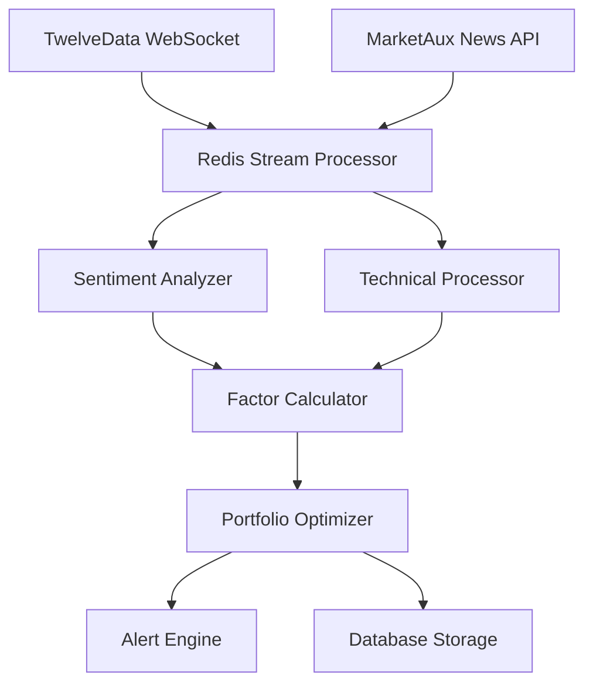

# 🧠 AI-Powered Data Fusion & Intelligence Platform

[← Back to Planned Features](README.md)

## Executive Summary

Transform Waardhaven AutoIndex into a next-generation financial intelligence platform that leverages advanced data fusion from multiple sources, incorporating vanguard techniques like multi-factor analysis, sentiment-driven portfolio optimization, and AI-powered alternative data processing.

## Market Opportunity

### Current Market Gap
- **Institutional-grade tools** remain locked behind high barriers ($50k+/year)
- **Retail platforms** offer basic portfolio management without intelligence
- **News sentiment analysis** not integrated with portfolio optimization
- **Alternative data** remains expensive and fragmented

### Our Solution
Democratize institutional-grade financial intelligence through:
- AI-powered multi-source data fusion
- Real-time sentiment-enhanced portfolio optimization
- Professional analytics at consumer-friendly pricing
- Modern architecture vs legacy competitors

## Technical Architecture

### 1. Multi-Source Data Fusion Engine

#### Primary Data Sources
- **TwelveData API**
  - Real-time price feeds via WebSocket
  - Historical data with technical indicators
  - Fundamental data (P/E, EPS, market cap)
  - Cross-asset coverage (stocks, ETFs, forex, crypto)

- **MarketAux API**
  - Global news coverage (5,000+ sources, 30+ languages)
  - Entity-level sentiment analysis (-1 to +1 scale)
  - Trending entity tracking
  - Industry and geographic filtering

#### Future Data Sources
- **ESG Data**: Sustainability scoring and news sentiment
- **Economic Indicators**: GDP, inflation, employment data
- **Social Sentiment**: Reddit, Twitter financial discussions
- **Satellite Imagery**: Economic activity indicators
- **Alternative Sources**: Patent filings, insider trading, options flow

### 2. AI-Powered Analytics Engine

#### Smart Beta Factors with Sentiment Enhancement
```yaml
Factor Models:
  Momentum Factor:
    - Traditional: Price momentum (3, 6, 12 months)
    - Enhanced: News sentiment momentum correlation
    - Weight: Technical trend + sentiment trend alignment

  Quality Factor:
    - Traditional: ROE, debt ratios, earnings stability
    - Enhanced: Earnings call sentiment, management tone
    - Weight: Fundamental quality + sentiment quality

  Value Factor:
    - Traditional: P/E, P/B, EV/EBITDA ratios
    - Enhanced: Contrarian news sentiment signals
    - Weight: Valuation metrics + sentiment discount

  Volatility Factor:
    - Traditional: Historical price volatility
    - Enhanced: News impact volatility prediction
    - Weight: Price vol + expected sentiment vol

  ESG Factor:
    - Traditional: ESG scores from providers
    - Enhanced: Sustainability news sentiment
    - Weight: ESG rating + sentiment momentum
```

#### Real-Time Portfolio Intelligence
- **Sentiment-Enhanced Allocation**: News sentiment influences factor weights
- **Risk Prediction**: Early warning based on news pattern recognition
- **Event Detection**: Automatic identification of market-moving events
- **Correlation Analysis**: Cross-asset sentiment correlation tracking

### 3. Event-Driven Data Pipeline

#### Architecture Pattern


#### Processing Flow
1. **Data Ingestion**: Real-time streams + scheduled batch jobs
2. **Normalization**: Unified data format across sources
3. **Sentiment Analysis**: Entity-level sentiment scoring
4. **Factor Calculation**: Multi-factor model computation
5. **Portfolio Optimization**: Constraint-based allocation
6. **Alert Generation**: Threshold-based notifications
7. **Storage**: Optimized for time-series queries

## Profitable Feature Tiers

### 🥉 Individual Tier - $9.99/month
**Target**: Retail investors, financial enthusiasts

#### Core Features
- **Smart Beta Portfolios**: Pre-configured factor-based allocations
- **Sentiment Dashboard**: Company and sector sentiment tracking
- **Basic Alerts**: Price targets and sentiment shifts
- **Educational Content**: Factor investing education with real examples

#### Data Access
- Daily sentiment updates
- Basic technical indicators
- End-of-day portfolio rebalancing
- Historical data (2 years)

#### Projected Users: 1,000
#### Annual Revenue: $120,000

### 🥈 Professional Tier - $49.99/month
**Target**: Financial advisors, active traders, small funds

#### Advanced Features
- **Real-Time Sentiment Analysis**: Minute-by-minute updates
- **Custom Factor Models**: Build and backtest custom strategies
- **Advanced Technical Indicators**: 50+ indicators with sentiment overlay
- **Multi-Asset Support**: Stocks, ETFs, crypto, forex
- **API Access**: Basic API for custom integrations

#### Analytics
- **Factor Attribution**: Performance breakdown by factor
- **Risk Analytics**: VaR, drawdown analysis with sentiment
- **Correlation Matrices**: Cross-asset sentiment correlation
- **Backtesting Engine**: Historical strategy performance

#### Projected Users: 200
#### Annual Revenue: $120,000

### 🥇 Institutional Tier - $199.99/month
**Target**: Asset managers, family offices, hedge funds

#### Enterprise Features
- **White-Label Platform**: Custom branding and deployment
- **Full API Access**: Complete data and analytics API
- **Custom Model Development**: Proprietary factor models
- **Dedicated Support**: Direct line to engineering team
- **Data Exports**: Bulk data downloads and custom reports

#### Advanced Analytics
- **Multi-Portfolio Management**: Manage multiple strategies
- **Client Reporting**: Automated performance reports
- **Compliance Tools**: Risk monitoring and reporting
- **Integration Support**: Connect to existing systems

#### Projected Users: 50
#### Annual Revenue: $120,000

### Total Projected ARR: $360,000+

## Implementation Roadmap

### Phase 1: Enhanced Data Pipeline (4 weeks)
**Focus**: Real-time data infrastructure

#### Week 1-2: TwelveData Enhancement
- [ ] Implement WebSocket streaming for real-time prices
- [ ] Expand technical indicator library
- [ ] Add fundamental data integration
- [ ] Optimize rate limiting and caching

#### Week 3-4: MarketAux Integration
- [ ] Complete sentiment analysis pipeline
- [ ] Implement entity extraction and tracking
- [ ] Build news aggregation system
- [ ] Create sentiment scoring algorithms

#### Technical Deliverables
- Redis Stream processing architecture
- Unified data normalization layer
- Real-time sentiment scoring engine
- Enhanced caching with automatic invalidation

### Phase 2: AI-Powered Analytics (6 weeks)
**Focus**: Intelligence and optimization engines

#### Week 5-7: Factor Model Development
- [ ] Implement traditional factor calculations
- [ ] Add sentiment enhancement layers
- [ ] Build factor attribution system
- [ ] Create performance tracking

#### Week 8-10: Portfolio Optimization
- [ ] Sentiment-enhanced allocation engine
- [ ] Real-time rebalancing algorithms
- [ ] Risk prediction models
- [ ] Alert and notification system

#### Technical Deliverables
- Multi-factor calculation engine
- Constraint-based portfolio optimizer
- Real-time alert system
- Risk analytics dashboard

### Phase 3: Monetization & Advanced Features (8 weeks)
**Focus**: Subscription tiers and enterprise features

#### Week 11-13: Subscription System
- [ ] Multi-tier access control
- [ ] Payment processing integration
- [ ] Usage tracking and billing
- [ ] API rate limiting by tier

#### Week 14-16: Professional Features
- [ ] Advanced analytics dashboard
- [ ] Custom factor builder
- [ ] Backtesting engine
- [ ] White-label capabilities

#### Week 17-18: Market Launch
- [ ] Beta testing with select users
- [ ] Marketing website and materials
- [ ] Customer support systems
- [ ] Launch preparation

## Competitive Analysis

### Traditional Competitors
| Platform | Pricing | Limitations | Our Advantage |
|----------|---------|-------------|---------------|
| Bloomberg Terminal | $24,000/year | Institutional only | 99% cost reduction |
| FactSet | $12,000/year | Complex UI | Modern interface |
| Refinitiv Eikon | $22,000/year | Legacy architecture | Cloud-native |
| YCharts | $3,600/year | Limited AI features | AI-powered insights |

### Fintech Competitors
| Platform | Focus | Missing Features | Our Differentiator |
|----------|-------|------------------|-------------------|
| Robinhood | Trading | No factor analysis | Professional analytics |
| Betterment | Robo-advisor | No customization | Custom factor models |
| Personal Capital | Wealth management | No sentiment data | News intelligence |
| Wealthfront | Smart beta ETFs | No real-time data | Real-time optimization |

### Key Differentiators
1. **First-to-Market**: Integrated news sentiment + portfolio optimization
2. **Democratization**: Professional tools at consumer prices
3. **Real-Time Intelligence**: Live sentiment-enhanced decisions
4. **Customization**: Build proprietary factor models
5. **Modern Architecture**: Fast, scalable, user-friendly

## Success Metrics

### Business KPIs
- **User Acquisition**: 50 new users/month by month 6
- **Revenue Growth**: $30k ARR by month 12
- **Churn Rate**: <5% monthly churn
- **Upgrade Rate**: 15% free-to-paid conversion

### Technical KPIs
- **Data Latency**: <1 second for real-time updates
- **System Uptime**: 99.9% availability
- **API Performance**: <200ms response time
- **Test Coverage**: 95%+ for financial calculations

### Product KPIs
- **User Engagement**: 70% weekly active users
- **Feature Adoption**: 80% use sentiment features
- **Customer Satisfaction**: NPS > 50
- **Data Quality**: <0.1% error rate in calculations

## Risk Mitigation

### Technical Risks
- **API Dependencies**: Multi-source backup data providers
- **Performance**: Horizontal scaling architecture
- **Data Quality**: Automated validation and monitoring
- **Security**: SOC 2 compliance and encryption

### Business Risks
- **Market Competition**: Focus on unique value proposition
- **Customer Acquisition**: Content marketing and partnerships
- **Regulatory**: Compliance with financial regulations
- **Revenue Model**: Freemium to reduce barrier to entry

### Operational Risks
- **Team Scale**: Hire gradually based on revenue milestones
- **Product Complexity**: Phased rollout with user feedback
- **Support Burden**: Self-service tools and documentation
- **Cash Flow**: Conservative burn rate and milestone funding

## Conclusion

This AI-powered data fusion platform represents a significant market opportunity to democratize institutional-grade financial intelligence. By combining real-time market data with news sentiment analysis and modern AI techniques, we can create a differentiated product that serves both retail and professional investors.

The phased implementation approach allows for iterative development and revenue generation, while the multi-tier pricing model ensures scalability from individual users to enterprise clients.

**Next Steps**: Begin Phase 1 implementation after completing comprehensive testing suite (Priority #0).

---
[← Back to Planned Features](README.md) | [View Implementation Details →](../../03-implementation/README.md)