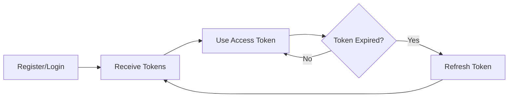

# Authentication API

[← Back to API Reference](../README.md)

## Overview
JWT-based authentication with refresh tokens and Google OAuth support.

## Endpoints

### User Registration
**POST** `/api/v1/auth/register`
```json
{
  "email": "user@example.com",
  "password": "SecurePass123!"
}
```
→ [Full Details](register.md)

### User Login
**POST** `/api/v1/auth/login`
```json
{
  "email": "user@example.com",
  "password": "SecurePass123!"
}
```
→ [Full Details](login.md)

### Google OAuth
**POST** `/api/v1/auth/google`
```json
{
  "credential": "google-id-token"
}
```
→ [Full Details](google-oauth.md)

### Get Current User
**GET** `/api/v1/auth/me`
- Requires: Bearer token
→ [Full Details](current-user.md)

### Refresh Token
**POST** `/api/v1/auth/refresh`
```json
{
  "refresh_token": "eyJ..."
}
```
→ [Full Details](refresh.md)

### Logout
**POST** `/api/v1/auth/logout`
- Requires: Bearer token
→ [Full Details](logout.md)

## Authentication Flow



## Token Details
- **Access Token**: 30 minutes expiry
- **Refresh Token**: 7 days expiry
- **Algorithm**: HS256
- **Storage**: Secure HTTP-only cookies (recommended)

## Security Notes
- Passwords hashed with bcrypt
- Tokens signed with SECRET_KEY
- Rate limiting: 5 attempts per minute
- Account lockout after 10 failed attempts

---
[← Back to API Reference](../README.md) | [Authentication Flow →](FLOW.md)